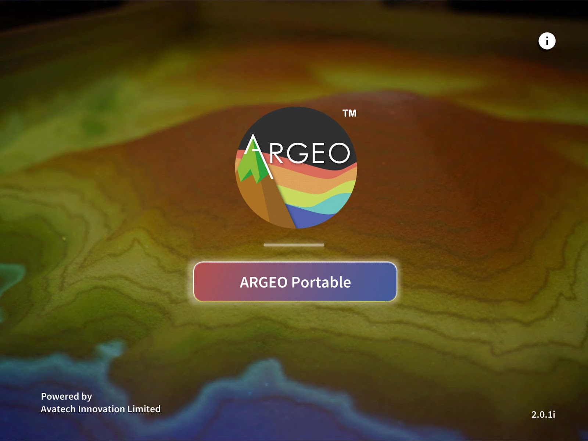

关于 ARGEO Portable Application
========

About the Product

|Logo| |Landing|

**ARGEO Portable** 是一个结合地理教学资源的应用程式，透过地形塑造，模拟出真实立体地理环境。同时，新版本加入了班级管理系统，分开教师帐户及学生帐户，而所有空间则会储存于云端系统内，使用过程中需保持网络连接。供老师分享萤幕到 ZOOM/GOOGLE MEET 等遥距教学应用程式帮助老师进行远程教学。

功能清单
************

.. |Logo| image:: images/Logo.png
  :width: 200
  :alt: Logo

