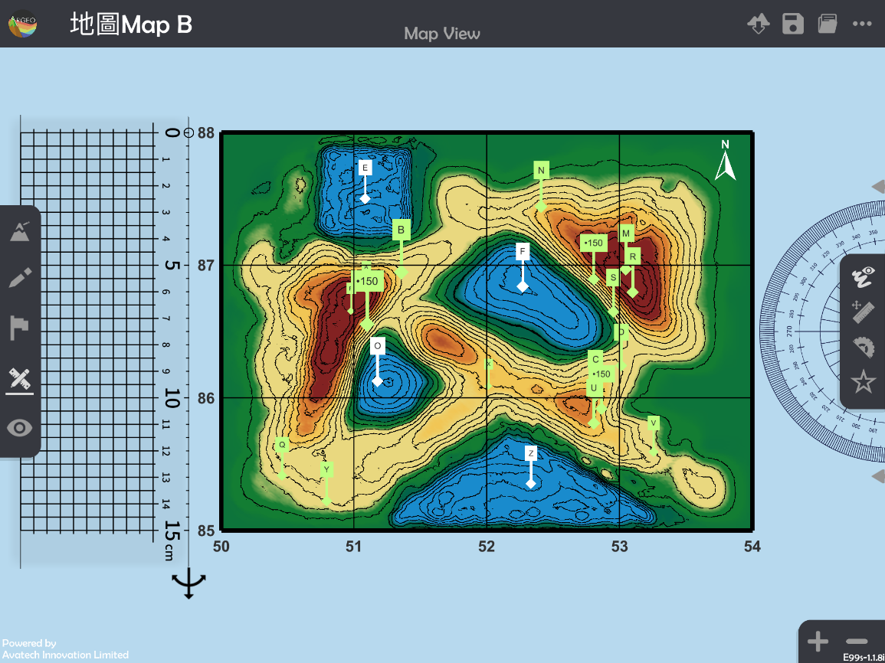
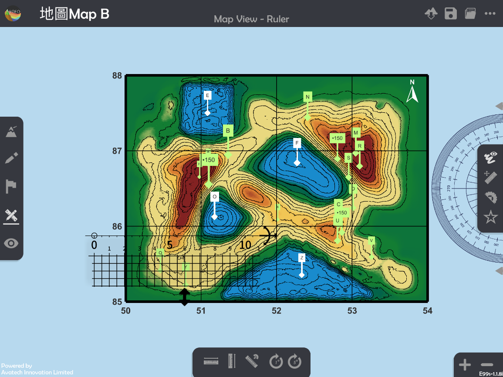
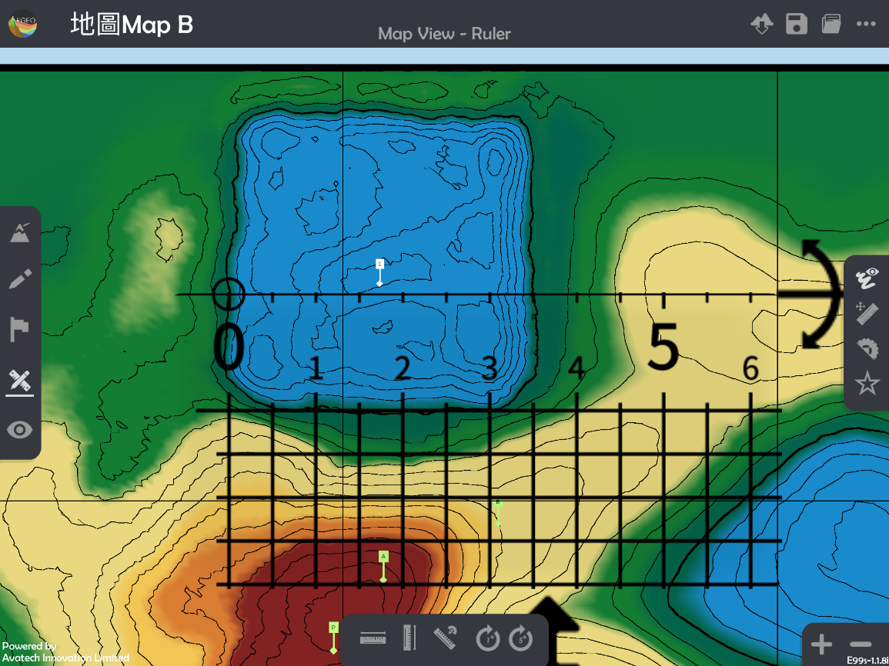
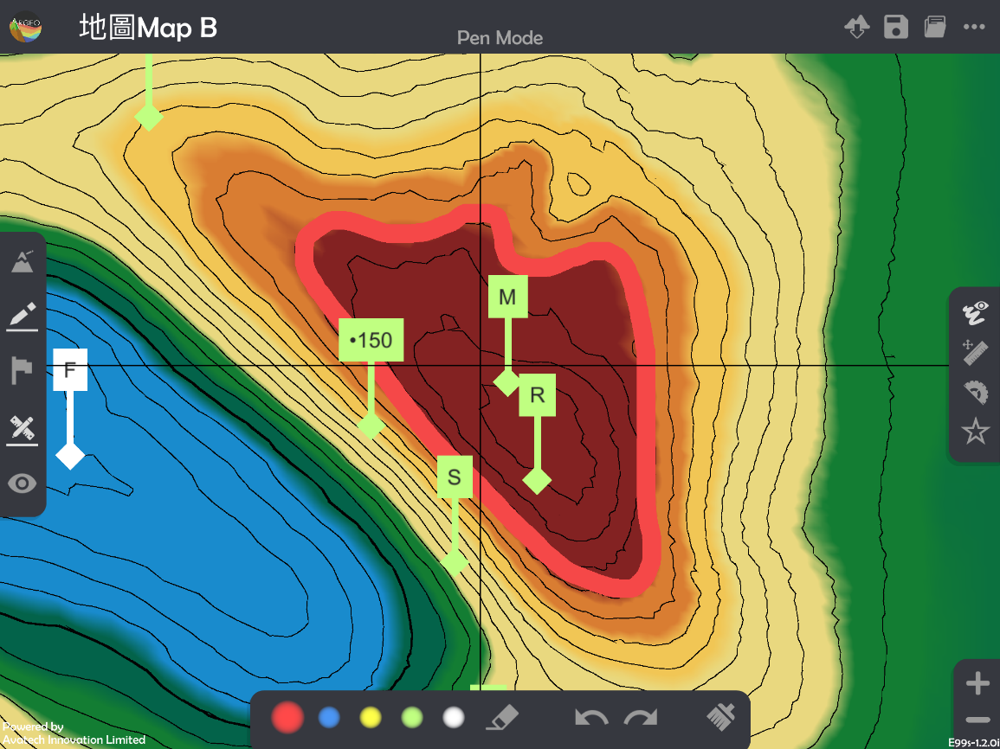
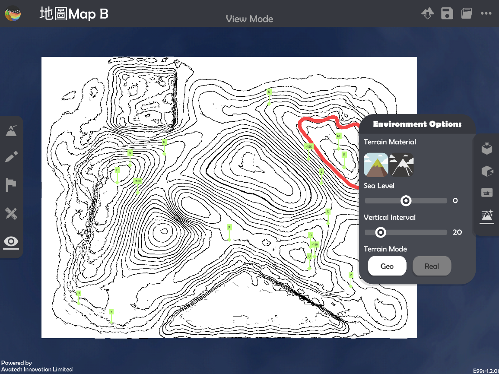
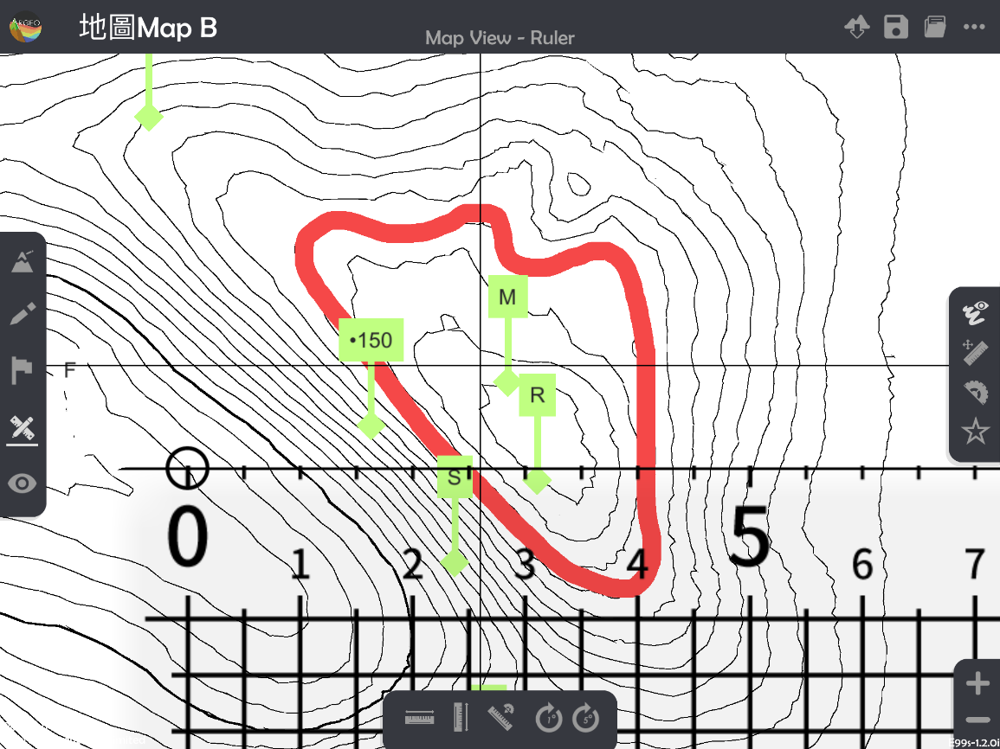
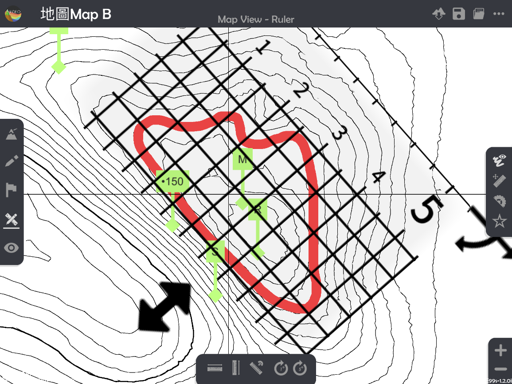
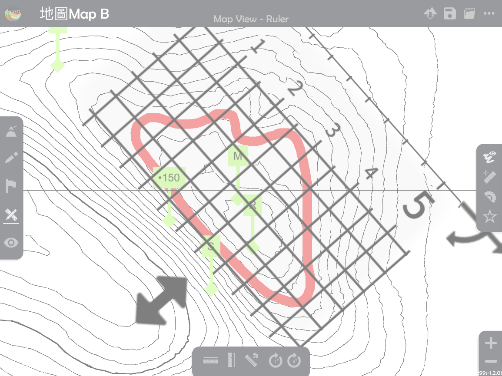

面积 Area
===================================

.. |preset_terrain| image:: area_images/preset_terrain.png
   :width: 30

.. |terrain_edit_mode| image:: area_images/terrain_edit_mode.png
   :width: 30

.. |mapview| image:: area_images/mapview.png
   :width: 30

.. |get_ruler| image:: area_images/get_ruler.png
   :width: 30

.. |horizontal_ruler| image:: area_images/horizontal_ruler.png
   :width: 30

.. |vertical_ruler| image:: area_images/vertical_ruler.png
   :width: 30

.. |pen| image:: area_images/pen.png
   :width: 30

.. |viewmode| image:: area_images/viewmode.png
   :width: 30

.. |environment_options| image:: area_images/environment_options.png
   :width: 30

.. |black_white| image:: area_images/black_white.png
   :width: 30

.. |get_ruler| image:: area_images/get_ruler.png
   :width: 30

教学指引
*********

以下示范如何以 ARGEO Portable 教导面积单元。

The following demonstration shows the teaching procedures of Area by using ARGEO Portable.

**计算规则形状物件的实际面积**
**Calculate the actual area of regular-shape object.**

a. 选择一个「预设地形(Preset Terrain) |preset_terrain|」或使用「地形塑造 |terrain_edit_mode|」功能建设一个地形，以下以在「地图Map B」计算E塘的实际面积为例子。
   
   Select a“Preset Terrain |preset_terrain|”or use“Terrain Modifying |terrain_edit_mode|”function to form a terrain. The following example is to calculate the actual area of Pond E in “地图Map B Preset Terrain”

.. image:: area_images/area1.png
  :width: 600
  :alt: 登入画面

b. 使用「地图介面 |mapview|」。

   Apply “Map View |mapview|".

c. 按「呼唤直尺」|get_ruler|。

   Apply “Get Ruler |get_ruler|”.

d. 放置和调校直尺以量度图案的长和阔。

   *可按「水平直尺 |horizontal_ruler|」和「垂直直尺 |vertical_ruler|」以调整直尺至水平或垂直。

   *可按「放大」和「缩小」以调整地图介面，减小误差。

   * “Horizontal Ruler |horizontal_ruler|” and “Vertical Ruler |vertical_ruler|” can be applied to adjust the ruler to horizontal or vertical. 

   * “Enlarge” and “Reduce” can be applied to adjust the “Map view” to reduce the measurement error. 

e. 计算实际面积。

   Calculate the actual area.

**计算不规则形状物件的实际面积**
**Calculate the actual area of irregular-shape object.**

a. 选择一个「预设地形(Preset Terrain) |preset_terrain| 」或使用「地形塑造 |terrain_edit_mode|」功能建设一个地形，以下以在「地图Map B」计算格网方格5286、5287、5386及5387中深啡色山体的部份的实际面积为例子。

   Select a “Preset Terrain |preset_terrain|” or use “Terrain Modifying |terrain_edit_mode|” function to form a terrain. The following example is to calculate the actual area of hill, which in dark brown colour in grid squares 5286, 5287, 5386, and 5387.

.. image:: area_images/area5.png
  :width: 600
  :alt: 登入画面

b. 使用「地图介面 |mapview|」。

   Apply “Map View |mapview|".

.. image:: area_images/area6.png
  :width: 600
  :alt: 登入画面

c. 选择「绘图工具 |pen|」，并勾画出想量度的面积。

*不建议使用白色绘画，因在随后的步骤会难以计算面积。

*可按「放大」和「缩小」以调整地图介面，减小误差。

Select “Drawing Tools |pen|” and sketch the outline of the area which needs to be measured. 

*White colour is NOT suggested to use in sketching as it will be difficult to calculate the area in the following steps.

*“Enlarge” and “Reduce” can be applied to adjust the “Map view” to reduce the error. 

d. 使用「观察模式 |viewmode|」。

   Apply "View Mode |viewmode|".

.. image:: area_images/area8.png
  :width: 600
  :alt: 登入画面

e. 选择「环境调整 |environment_options|」，并在地貌颜色选择黑白色 |black_white|。

   Apply “Environment Option |environment_options|” and select the terrain material in black and white (missing signal logo). 

f.  使用「地图介面 |mapview|」。

   Apply “Map View |mapview|".

.. image:: area_images/area10.png
  :width: 600
  :alt: 登入画面

g. 按「呼唤直尺 |ruler|」。

   Select “Call Ruler |get_ruler|”.

h. 把直尺上的方格覆盖在物件上。

*应把直尺调校至取得最多的完整方格。

Cover the grids on the object. 

*Try to get as more complete squares as possible, when adjusting the ruler.

i. 数点完整方格及不完整方格的数目。

*红色数字为完整方格、蓝色数字为不完整方格。

Count the number of complete and incomplete squares. 

*The red numbers are the complete squares, while the blue numbers are the incomplete squares.

j. 计算总格数。

   Calculate the total number of squares.

k. 计算实际面积。

   Calculate the actual area.

下载教学资源
***************
教学指引
`按此下载 <https://drive.google.com/file/d/12R2nXGHdFn0_I3p5RI03WZq74EA9_uQm/view?usp=sharing>`_

工作纸及答案(中文版)
`按此下载 <https://drive.google.com/drive/folders/18h0_oens_dF2TVBg6NXzF3qyvsLnN0dz?usp=sharing>`_

工作纸及答案(英文版)
`按此下载 <https://drive.google.com/drive/folders/1-6cRwc3f9oWaqignF0yTBubCasHDZqD6?usp=sharing>`_

