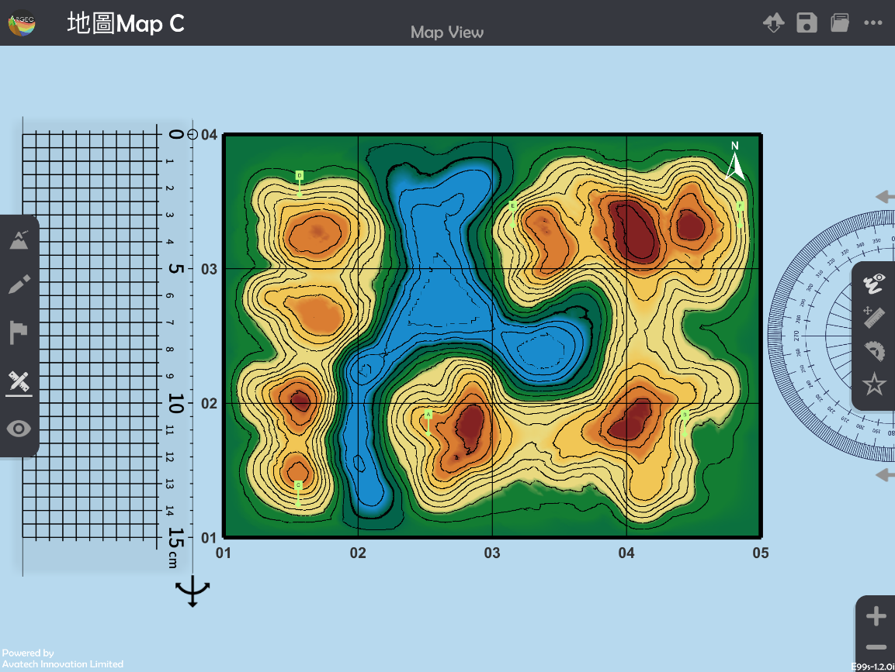
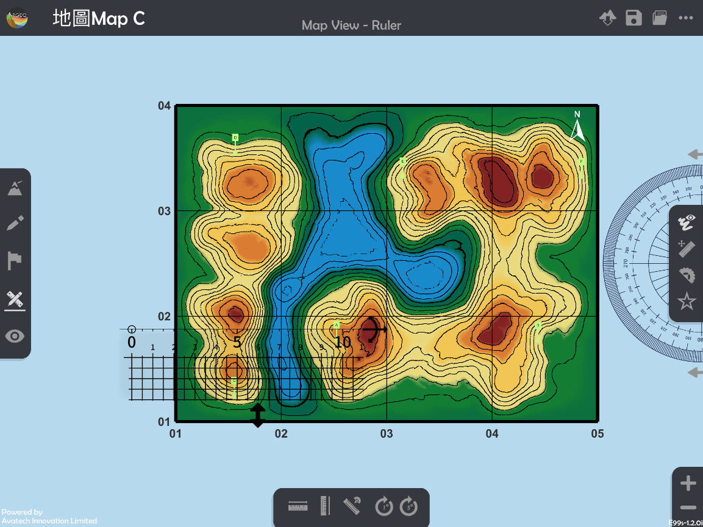
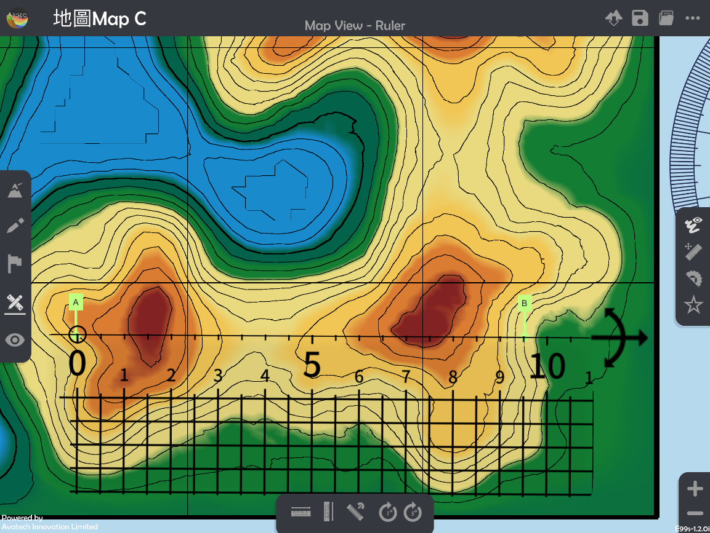

横切面 Cross-section
===================================

.. |preset_terrain| image:: cross_section_images/preset_terrain.png
   :width: 30

.. |terrain_edit_mode| image:: cross_section_images/terrain_edit_mode.png
   :width: 30

.. |mapview| image:: cross_section_images/mapview.png
   :width: 30

.. |get_ruler| image:: cross_section_images/get_ruler.png
   :width: 30

.. |viewmode| image:: cross_section_images/viewmode.png
   :width: 30

.. |cross_section| image:: cross_section_images/cross_section.png
   :width: 30

教学指引
*********

以下示范如何以 ARGEO Portable 教导横切面单元。 

The following demonstration shows the teaching procedures of cross-section by using ARGEO Portable. 

a. 选择一个「预设地形(Preset Terrain) |preset_terrain|」或使用「地形塑造 |terrain_edit_mode|」功能建设一个地形，以下以在「地图Map C Preset Terrain」绘画A点到B点的横切面图为例子。
   
   Select a landform from “Preset Terrain |preset_terrain|” or use “Terrain Modifying |terrain_edit_mode|”function to create a landform. The following example is to draw a cross-section from point A to B in “地图Map C Preset Terrain”.

.. image:: cross_section_images/cross_section1.png
  :width: 600
  :alt: 登入画面

b. 使用「地图介面 |mapview|」。

   Apply “Map View |mapview|”.

c. 按「呼唤直尺 |get_ruler|」。

   Apply “Get Ruler |get_ruler|”.

d. 放置和调校直尺连接AB两点。

   Place and adjust the ruler on Point A and B.

e. 将AB两点所穿过的等高线记录在现实的纸条和直尺上。

   Record the height of contour lines across the Point A and B on a piece of paper and ruler in real life.

.. image:: cross_section_images/cross_section5.jpg
  :width: 600
  :alt: 登入画面

f. 利用已记录高度的纸条绘画横切面图。

   Draw the cross-section with the paper which records the height.

.. image:: cross_section_images/cross_section6.jpg
  :width: 600
  :alt: 登入画面

g. 使用「观察模式 |viewmode|」。

   Apply “View Mode |viewmode|”.

.. image:: cross_section_images/cross_section7.png
  :width: 600
  :alt: 登入画面

h. 按「横切面 |cross_section|」，并使用滑杆标调整横切面位置和垂直夸大率，核对手绘横切面图。
   
   Select “Cross-section |cross_section|” and use the slider to adjuct and position of cross-section and vertical exaggeration to check the cross-section.

.. image:: cross_section_images/cross_section8.jpg
  :width: 600
  :alt: 登入画面 

下载教学资源
***************
教学指引
`按此下载 <https://drive.google.com/file/d/1NqomonxqYHCGY8Ax197AUrpfoD0nG9lD/view?usp=sharing>`_

工作纸及答案(中文版)
`按此下载 <https://drive.google.com/drive/folders/1ILmQLdeMXUSZbcGZqvOPCQjOST6Sn0uh?usp=sharing>`_

工作纸及答案(英文版)
`按此下载 <https://drive.google.com/drive/folders/1Z0cfZKpeVzPHsX-sQse7sn7cYLWWFG1_?usp=sharing>`_

