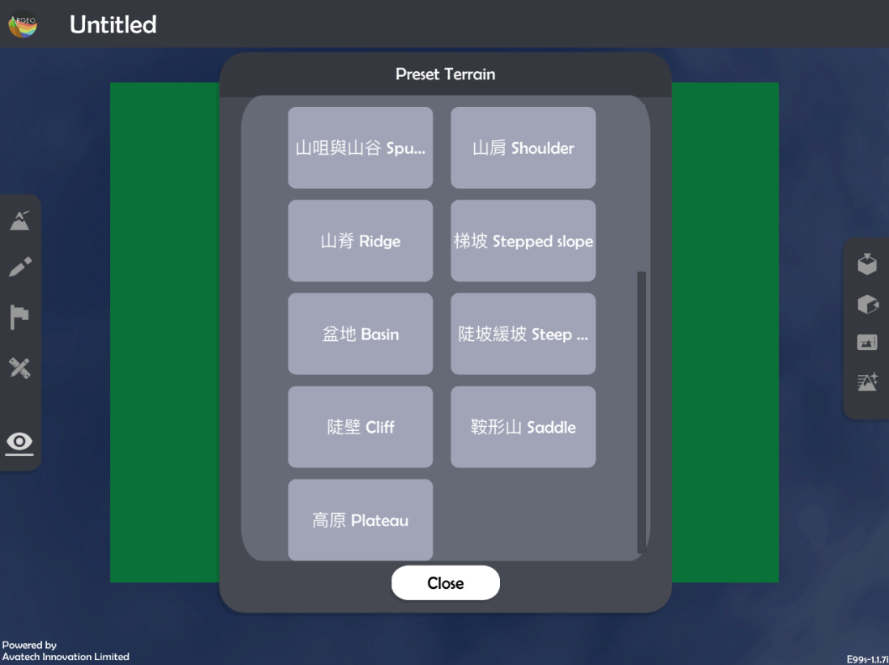
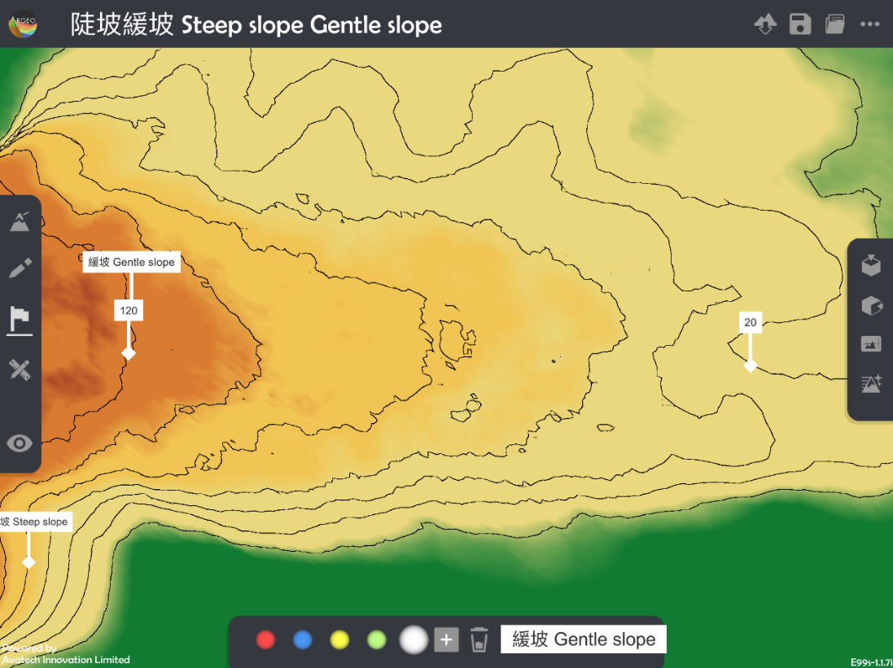
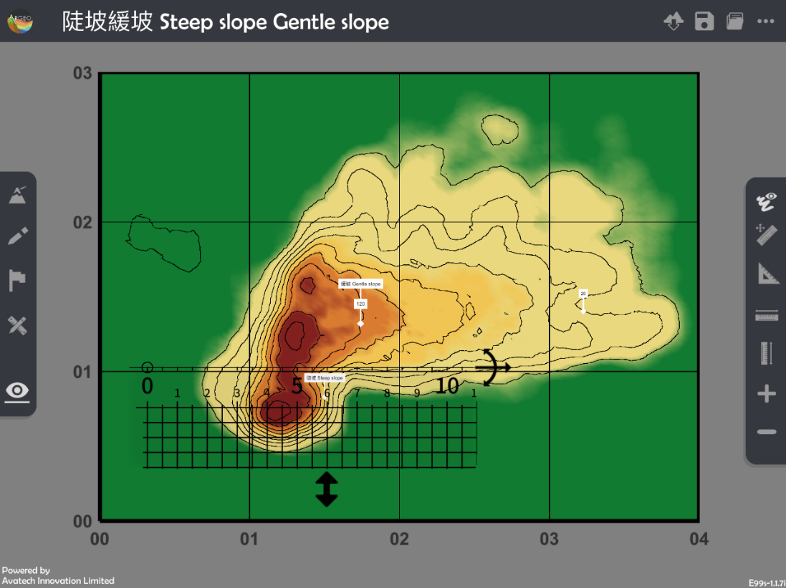
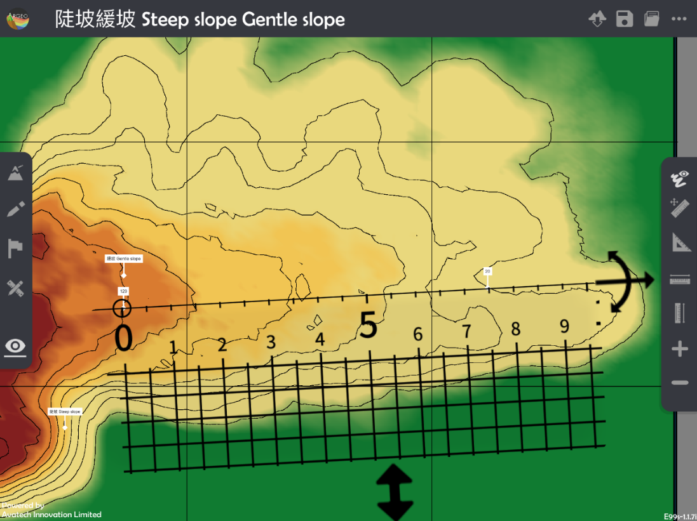

坡度 Gradient
===================================

.. |terrain_edit_mode| image:: gradient_images/terrain_edit_mode.png
   :width: 30

.. |label| image:: gradient_images/label.png
   :width: 30

.. |mapview| image:: gradient_images/mapview.png
   :width: 30

.. |get_ruler| image:: gradient_images/get_ruler.png
   :width: 30

教学指引
*********

以下示范如何以 ARGEO Portable 教导坡度单元。

The following demonstration shows the teaching procedures of Gradient by using ARGEO Portable.

a. 选择一个有斜坡的「预设地形 (Preset Terrain) |preset_terrain|」或使用「地形塑造 |terrain_edit_mode|」功能建设一个斜坡，以下以「陡坡缓坡Steep slope Gentle slope」为例子。
   
   Select a slope from “Preset Terrain |preset_terrain|” or use “Terrain Modifying |terrain_edit_mode|” function to form a slope. The following example is “陡坡缓坡Steep slope Gentle slope”. 

b. 使用「标记工具 |label|」在斜坡上标记两点并写上正确的高度。

   Apply“Labelling Tools |label|”to mark two points on the slope and state the correct height.

老师可以使用「环境调整 |environment_options|」调校垂直间距。

Teacher can apply “Environment Option |environment_options|”to adjuct the vertical interva

.. |environment_options| image:: gradient_images/environment_options.png
   :width: 30

c. 计算两点的垂直距离。

   Calculate the vertical distance of two objects.

d. 使用「地图介面 |mapview|」。

   Apply “Map View |mapview|".

.. image:: gradient_images/gradient3.png
  :width: 600
  :alt: 登入画面 

e. 按「呼唤直尺 |get_ruler|」以显示直尺在荧幕上。

   Apply “Get Ruler |get_ruler|” to show the ruler on the screen.

f. 放置和调校直尺在两点标记上以量度直线水平距离。 
   
   Place and adjust the ruler on the objects to measure the straight-line horizontal distance. 
 

g. 计算坡度。 

   Calculate the gradient.

下载教学资源
***************
教学指引
`按此下载 <https://drive.google.com/file/d/19kp5-xxI0uoDpC6wKb2ozvDhCzYjOY9c/view?usp=sharing>`_

工作纸及答案(中文版)
`按此下载 <https://drive.google.com/drive/folders/1-XFwKDM6wJ3b9bkNE6hLAVLOA4tpytVP?usp=sharing>`_

工作纸及答案(英文版)
`按此下载 <https://drive.google.com/drive/folders/1NFPbJSBwv4nIPcX3-oBLdfH2WeGiNXPm?usp=sharing>`_