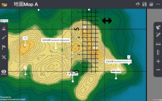

格网座标 Grid Reference 
===================================

.. |preset_terrain| image:: grid_reference_images/preset_terrain.png
   :width: 30

.. |mapview| image:: grid_reference_images/mapview.png
   :width: 30

.. |horizontal_ruler| image:: grid_reference_images/horizontal_ruler.png
   :width: 30

.. |vertical_ruler| image:: grid_reference_images/vertical_ruler.png
   :width: 30

教学指引
*********

以下示范为如何以 ARGEO Portable 教授格网座标单元

The following demonstration shows the teaching procedures of Grid Reference by using ARGEO Portable. 

a. 在「预设地形（Preset Terrain）|preset_terrain|」中选择「地图 A」。
   
   Select “Map A” in “Preset Terrain |preset_terrain| ”. 

b. 使用「地图介面（Map view）|mapview| 」，可见格网线显示在地图上。

   Apply the “Map view |mapview|”. The grid lines are shown on the map. 

.. image:: grid_reference_images/grid_reference1.png
  :width: 600
  :alt: 登入画面

c. 按一下格网线数字，设定北行线是由 10 开始，东行线是由 65 开始（老师可因应需要自行调整格网线数 字）。 

   Press the grid line value. Set the starting point of northings is 10 and that of eastings is 65. (Teacher can  customise the grid line values.)  

d. 找出 B 点的六位格网座标 

   Find the six-figure grid reference of point B.

方法一 Method 1

e. 将整把直尺放在格网方格 6711 内。先由左至右数格仔，再由下至上数格仔（第一格为 0，最后一格为 9），记录六位格网座标。 

   Place the ruler on the grid square. Count the grids from left to right, then from bottom to top (The first grid is 0 and  the last grid is 9). Take the readings to form six-figure grid reference. 

.. image:: grid_reference_images/grid_reference2.png
  :width: 600
  :alt: 登入画面

方法二 Method 2 

f. 按下「水平直尺（Horizontal ruler）|horizontal_ruler| 」按钮，把直尺水平放在 B 点上，令直尺与北行线平行。 

   Press the “Horizontal ruler |horizontal_ruler|” button. Place the ruler on the point B and make it parallel to the northings. 

.. image:: grid_reference_images/grid_reference3.png
  :width: 600
  :alt: 登入画面

g. 直尺上每 0.5 厘米为一小格，由左至右第一格为 0，最后一格为 9，记录东行线座标。 

   Each grid equals to 0.5 cm. The first grid is 0 and the last grid is 9. Take the reading of easting.

h. 按下「垂直直尺（Vertical ruler）|vertical_ruler|」按钮，把直尺水平放在 B 点上，令直尺与东行线平行。

   Press the “Vertical ruler |vertical_ruler|” button. Place the ruler on the point B and make it parallel to the eastings.

i. 直尺上每 0.5 厘米为一小格，由下至上第一格为 0，最后一格为 9，记录北行线座标。

   Each grid equals to 0.5 cm. The first grid is 0 and the last grid is 9. Take the reading of northing. 

.. image:: grid_reference_images/grid reference4.png
  :width: 600
  :alt: 登入画面

j. 将东行线和北行线座标组合，成为六位格网座标。

   Combine the easting and northing readings to form a six-figure grid reference

下载教学资源
***************
教学指引
`按此下载 <https://drive.google.com/file/d/1ybrH-kOdVbjibZeJE5mFdPVlFdQPBJjL/view?usp=sharing>`_

工作纸及答案(中文版)
`按此下载 <https://drive.google.com/drive/folders/17X3eHlA2yE2jvBB5eFTd2iQ05chh_UkP?usp=sharing>`_

工作纸及答案(英文版)
`按此下载 <https://drive.google.com/drive/folders/1Hjg0CU7RWYMLQbXq5YUbtK3CF-OMaihT?usp=sharing>`_