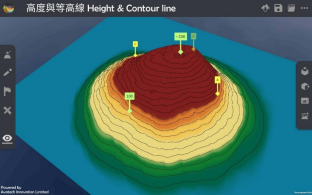

高度与等高线 Height & Contour line  
===================================

.. |preset_terrain| image:: height_contour_line_images/preset_terrain.png
   :width: 30

.. |environment_options| image:: height_contour_line_images/environment_options.png
   :width: 30

教学指引
*********

以下示范为如何以 ARGEO Portable 教授高度与等高线单元 

The following demonstration shows the teaching procedures of Height & Contour line by using ARGEO Portable. 

a. 在「预设地形（Preset Terrain）|preset_terrain|」中，选择「高度与等高线」。
   
   Apply the “Preset terrain |preset_terrain|” function. Select “Height & Contour line”. 

b. 在「环境调整（Environment Options）|environment_options|」中调节「垂直间距（Vertical Interval）」至 40。 

   Adjust the “Vertical Interval” to 40 on the “Environment Options |environment_options|”. 

.. image:: height_contour_line_images/height_contour_line1.png
  :width: 600
  :alt: 登入画面

c. 利用已预设的高程点及其他等高线指示，找出 A 点、B 点和 C 点的高度。

   Refer to the information provided on the map. Find the height of point A, B and C.  

d. 老师可以再塑造更多地形教导学生。
   
   Teachers can create more landforms for teaching. 

下载教学资源
***************
教学指引
`按此下载 <https://drive.google.com/file/d/1-oSkAR-pfz0bR5fphi0kq0SEHqdhJEc0/view?usp=sharing>`_

工作纸及答案(中文版)
`按此下载 <https://drive.google.com/drive/folders/1evydDGNfzUdUHAvcW9IYECk5D_iOhi38?usp=sharing>`_

工作纸及答案(英文版)
`按此下载 <https://drive.google.com/drive/folders/1vu-qVJFd6_6pDEEsrE4tI3_1OL4k5VS0?usp=sharing>`_