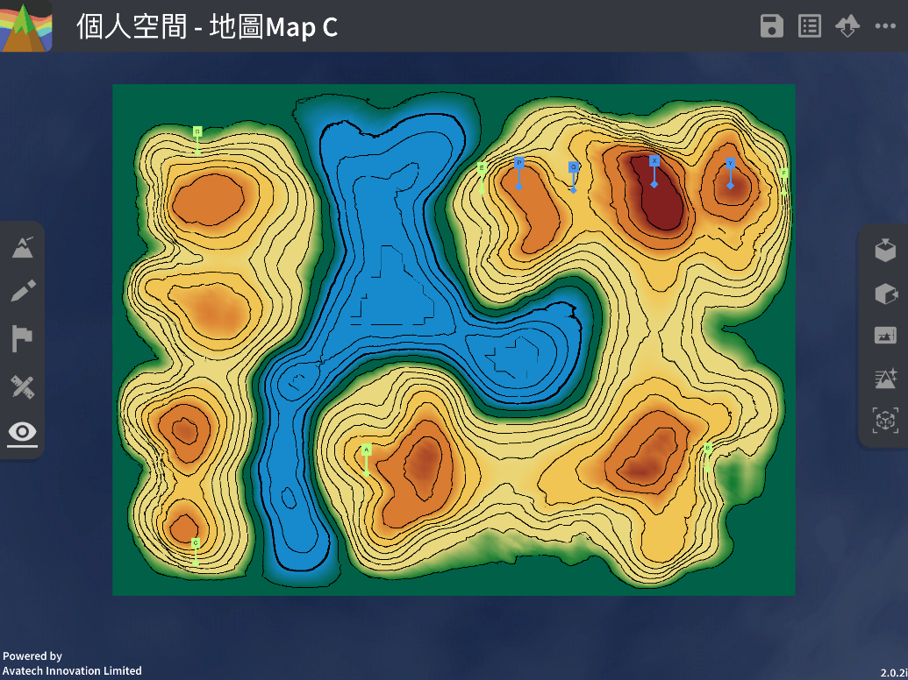
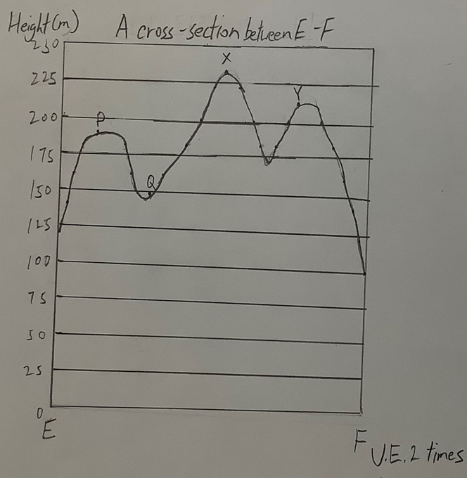

互见度 Intervisibility
===================================

.. |preset_terrain| image:: intervisibility_images/preset_terrain.png
   :width: 30

.. |terrain_edit_mode| image:: intervisibility_images/terrain_edit_mode.png
   :width: 30

教学指引
*********

以下示范如何以 ARGEO Portable 教导互见度单元。

The following demonstration shows the teaching procedures of intervisibility by using ARGEO Portable.

a. 选择一个「预设地形(Preset Terrain) |preset_terrain|」或使用「地形塑造 |terrain_edit_mode|」功能建设一个地形，以下以在「地图Map C Preset Terrain」分辨E点到F点的互见度为例子。
   
   Select a landform from “Preset Terrain”|preset_terrain| or use “Terrain Modifying”|terrain_edit_mode| function to create a landform. The following example is to determine the intervisibility of point E to F in “地图Map C Preset Terrain”.

b. 绘画E点到F点的横切面图。（参阅横切面指引）

   Draw the cross-section between point E to F. (Refer to cross-section guideline)

c. 分辨横切面图中的两点是否互见。

   Determine the two points in the cross-section are visible or not.

.. image:: intervisibility_images/intervisibility3.png
  :width: 600
  :alt: 登入画面 

下载教学资源
***************
教学指引
`按此下载 <https://drive.google.com/file/d/1GWqbKvPYPepz4XyqQM9nFgW_1LeBDaGx/view?usp=sharing>`_

工作纸及答案(中文版)
`按此下载 <https://drive.google.com/drive/folders/1MnBvbJ7F1HgXOfznDq_XWieaGtEh5fuL?usp=sharing>`_

工作纸及答案(英文版)
`按此下载 <https://drive.google.com/drive/folders/1Dkf1vqwdYMsz1fRfiZRUftQ6ADoYWxiV?usp=sharing>`_