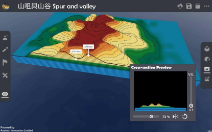

地形 Relief
===================================

.. |topview| image:: relief_images/topview.png
   :width: 30

.. |viewmode| image:: relief_images/viewmode.png
   :width: 30

.. |cross_section| image:: relief_images/cross_section.png
   :width: 30

教学指引
*********

以下示范如何以 ARGEO Portable 教导地形单元。 

The following demonstration shows the teaching procedures of Relief by using  ARGEO Portable.  

a. 选择一个「预设地形（Preset Terrain）|preset_terrain|」，并选择想教授的地形，以下以 选择「山咀与山谷 Spur and valley」为例子。
   
   Select a relief which you want to teach in “Preset Terrain |preset_terrain|”. The following example is “山咀与山谷 Spur and valley”. 

.. image:: relief_images/relief1.png
  :width: 600
  :alt: 登入画面

b. 使用「俯视角度 |topview|」功能观察地形的等高线。 

   Use“Top View |topview| ”function to observe the contour line of the relief.

.. image:: relief_images/relief2.png
  :width: 600
  :alt: 登入画面

c. 选择「观察模式 |viewmode| 」调校视角以观察地形。

   Use“View Mode |viewmode|”to adjust the camera to observe the relief. 

.. image:: relief_images/relief3.png
  :width: 600
  :alt: 登入画面

d. 选择「横切面 |cross_section| 」功能，并以滑杆标调校横切面至合适的位置。
   
   Use “Cross-section |cross_section|”function and adjust the slider to the suitable position.

调校垂直夸大率观察横切面图。 

Adjuct the vertical exaggeration to observe the cross-section.

.. image:: relief_images/relief5.png
  :width: 600
  :alt: 登入画面 

下载教学资源
***************
教学指引
`按此下载 <https://drive.google.com/file/d/1Tj_ijsdVTe9D6oBr8S_JW2Sdn6DNBf18/view?usp=sharing>`_

工作纸及答案(中文版)
`按此下载 <https://drive.google.com/drive/folders/1HkUXNRGgrk73h6h1_Oj8GT5MC5jjGNWT?usp=sharing>`_

工作纸及答案(英文版)
`按此下载 <https://drive.google.com/drive/folders/19Q_KMspOaGp83fJk713zMUCbfws-vhCs?usp=sharing>`_
