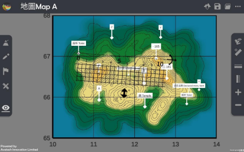

直线距离 Straight-line distance 
===================================

.. |preset_terrain| image:: straight_line_distance_images/preset_terrain.png
   :width: 30

.. |terrain_edit_mode| image:: straight_line_distance_images/terrain_edit_mode.png
   :width: 30

.. |label| image:: straight_line_distance_images/label.png
   :width: 30

.. |mapview| image:: straight_line_distance_images/mapview.png
   :width: 30

教学指引
*********

以下示范如何以 ARGEO Portable 教导直线距离单元。 

The following demonstration shows the teaching procedures of Straight-line distance  by using ARGEO Portable. 

a. 选择一个「预设地形 (Preset Terrain) |preset_terrain|」或使用「地形塑造 |terrain_edit_mode| 」功能建设 一个地形，以下以「地图 Map A」为例子。
   
   Select a “Preset Terrain |preset_terrain|” or use “Terrain Modifying |terrain_edit_mode|” function to form a  terrain. The following example is “地图 Map A”. 

.. image:: straight_line_distance_images/straight_line_distance1.png
  :width: 600
  :alt: 登入画面

b. 使用「标记工具 |label|」在地形上标记

   Apply “Labelling Tools |label|” to mark two points on the terrain.

c. 使用「地图介面 |mapview| 」

   Apply “Map View |mapview|”. 

.. image:: straight_line_distance_images/straight_line_distance3.png
  :width: 600
  :alt: 登入画面

d. 按「取得直尺」以显示直尺在荧幕上。 
   
   Apply “Get Ruler” to show the ruler on the screen.

.. image:: straight_line_distance_images/straight_line_distance4.png
  :width: 600
  :alt: 登入画面

e. 放置和调校直尺在两点标记上，以下以量度厕所（格网座标 106670）与高程点 165（格网座标 125669）为例子。 

   Place and adjust the ruler on the two points. The following example is to measure the distance between toilet (106670) and spot height 165 (125669). 

计算直线距离。

Calculate the straight-line distance.

下载教学资源
***************
教学指引
`按此下载 <https://drive.google.com/file/d/1X8VxnZuft8cLTGL66m_V6eu9OWkhAicI/view?usp=sharing>`_

工作纸及答案(中文版)
`按此下载 <https://drive.google.com/drive/folders/1QLrHqutPkC75cZDduW7OddyihZDEGRwD?usp=sharing>`_

工作纸及答案(英文版)
`按此下载 <https://drive.google.com/drive/folders/1BmOVN-a5ZIyu6qyDqe3RaOYsik9lxPNq?usp=sharing>`_

