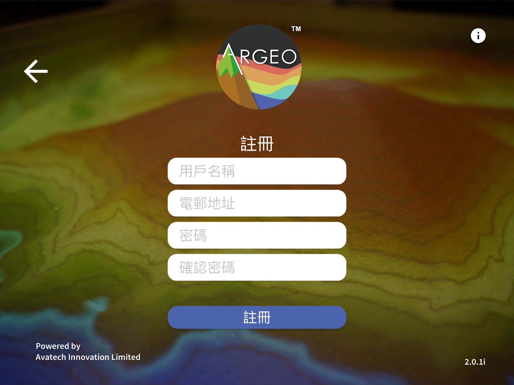
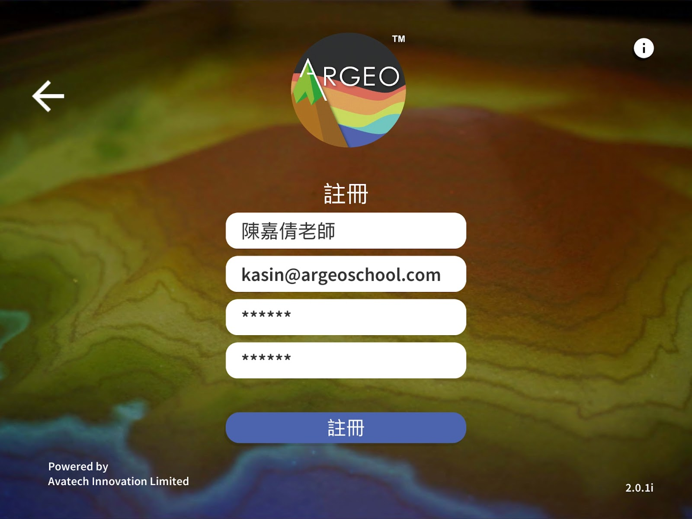
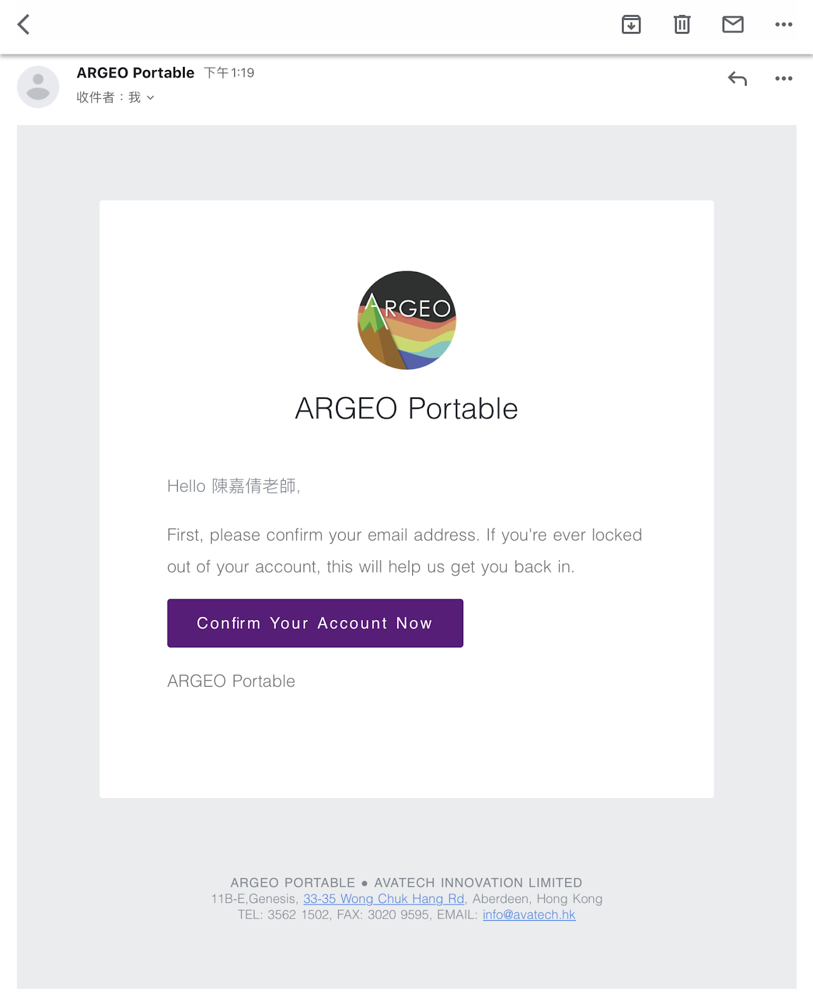
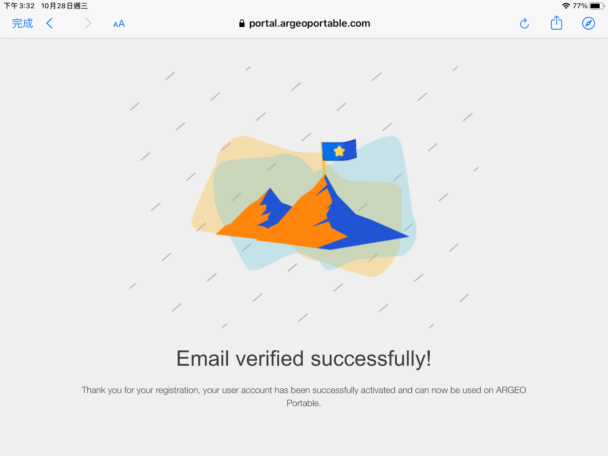
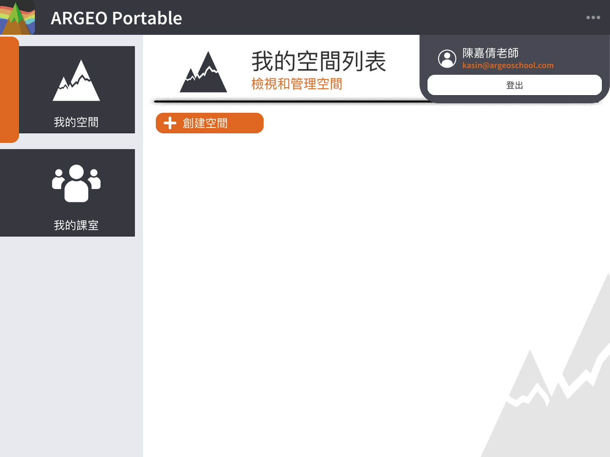
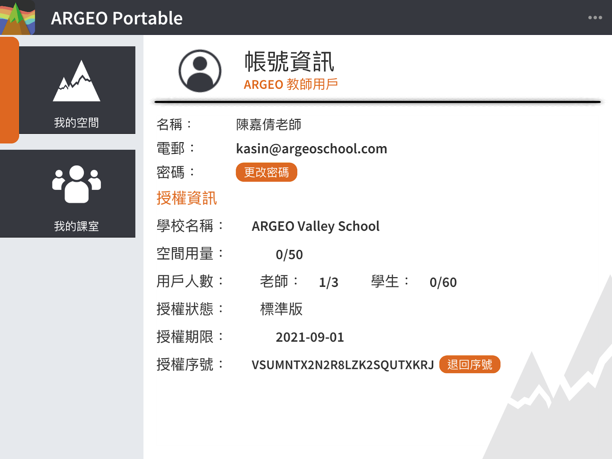

帐户
===================================

注册帐户
-----------------------
按下［注册帐号］连结

.. image:: account_images/accountreg.jpg
  :width: 600
  :alt: 登入画面

注册帐户：输入用户名称（日后可更改）、电邮地址、密码及确认密码
	- 用户名称可由中文或英文组成
	- 请输入一个真实的电邮地址，稍后会用作验证用途
	- 密码可由英文、数字或符号组成，密码长度最少为６个字元
	- 确认密码：输入多一次密码

注册成功后请查阅电邮进行电邮验证，在电邮中按下［Confirm Your Account Now］

  

然后返回 ARGEO Portable 应用程式，并按下［我已经进行验证］

.. image:: account_images/accountreg5.jpg
  :width: 600
  :alt: Alternative text

启动教师帐户
-----------------------
当电邮验证完成后，请选择帐号类型为教师（Teacher），然后按下一步，并输入许可证序号。
	－许可证序号由官方系统进行派发，如未获得许可证序号，请联络我们

.. image:: account_images/accountreg6.jpg
  :width: 600
  :alt: Alternative text

确认后载入以下画面代表许可证成功启动

.. image:: account_images/accountreg8.png
  :width: 600
  :alt: Alternative text

启动学生帐户
-----------------------
当电邮验证完成后，请选择帐号类型为学生（Student），然后按下一步，并输入班级邀请码。
- 班级邀请码由教师帐号建立班级而自动产生

确认后载入以下画面代表成功进入班级

查看帐户资讯
-----------------------
点选右上方［．．．］按钮，再按下个人名称一栏，便可查看帐号资讯，包括学校名称、用户人数、许可证序号、许可证到期日等资讯。
您可分享许可证序号给另一位教师作启动教师帐户，使用同一许可证序号启动后，系统会自动把该名教师帐户加入您的许可证，而用户人数亦会自动增加。

**许可证用量计算方法**
**用户人数**
用户人数根据许可证计划而定，分别是教师用户人数及学生用户人数。
教师用户人数根据教师帐户成功启动许可证而计算，若教师用户离开了许可证则不计算在内。
学生用户人数根据学生帐户成功加入班级而计算，即使学生帐户加入多个班级也只会占用一个学生用户人数，若学生帐户离开了许可证则不计算在内。

**更多资讯**：我的班级－教师帐户－离开许可证；我的班级－教师帐户－移除学生许可证权限
空间用量
空间用量根据许可证计划而定，分别是教师空间用量及学生空间用量。如已占用的空间用量已满，帐户将无法再建立新的空间。

教师空间用量以「我的空间」、「黑板」及「习作」的空间总和数量而计算。空间用量以帐户已建立的空间计算，不会与其他教师帐户共同计算。

学生空间用量以「我的空间」及「习作」计算。

- 我的空间：空间用量以帐户已建立的空间计算。

- 黑板：不会计算空间用量

- 习作：空间用量以帐户的习作数量而计算。由于习作是由教师帐户于班级内所建立的，如教师建立了一份习作，在班级内每个学生的空间用量都会因而加一。若学生的空间用量已满，教师再新建立的习作仍然能够分配给空间用量已满的学生，学生仍然能够储存习作。唯学生不能再在「我的空间」建立空间，而学生空间用量会超额显示。

