操作教学
=================================== 

.. |viewmode| image:: control_images/viewmode.png
   :width: 30

.. |topview| image:: control_images/topview.png
   :width: 30

.. |sideview| image:: control_images/sideview.png
   :width: 30

.. |terrain_edit_mode| image:: control_images/terrain_edit_mode.png
   :width: 30

.. |extrude_up| image:: control_images/extrude_up.png 
   :width: 30

.. |pen| image:: control_images/pen.png
   :width: 30

.. |undo_white| image:: control_images/undo_white.png
   :width: 30

.. |redo_white| image:: control_images/redo_white.png
   :width: 30

.. |drawing_hide| image:: control_images/drawing_hide.png
   :width: 30

.. |ruler_rotate| image:: control_images/ruler_rotate.png
   :width: 30

.. |horizontal_ruler| image:: control_images/horizontal_ruler.png
   :width: 30

.. |vertical_ruler| image:: control_images/vertical_ruler.png
   :width: 30

.. |cross_section| image:: control_images/cross_section.png
   :width: 30

.. |environmentoptions| image:: control_images/environmentoptions.png
   :width: 30

.. |presetterrain| image:: control_images/presetterrain.png
   :width: 30

介面介绍
-----------------------

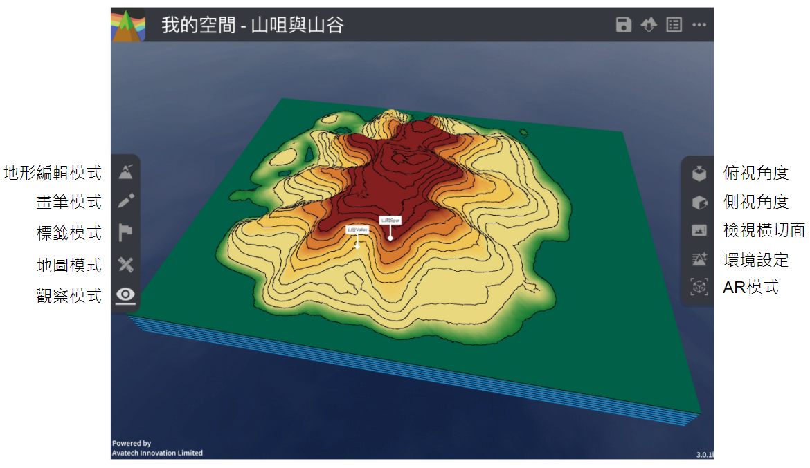

功能总览
-----------------------

.. image:: control_images/overall_function.png 
  :width: 400
  :alt: Alternative text

功能
-----------------------
视角操控(View Control)
    观察模式(View Mode):
    按左边工具栏的 |viewmode| 启动观察模式，下方的工具操控台将会被收起，用家可以单指调整观察方位，移动至最佳视角，从不同角度观察地势

.. image:: control_images/view_control_mode.png
  :width: 400
  :alt: Alternative text

双指操控(Two-finger Gesture):
-----------------------
用家可随时以双指调整或旋转观察方位、放大、缩小以及调整仰角

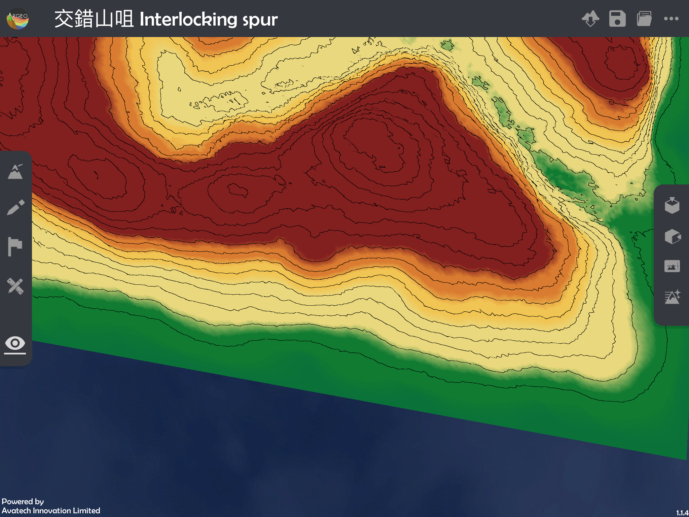

.. image:: control_images/finger_control2.png
  :width: 400
  :alt: Alternative text

.. image:: control_images/finger_control3.png
  :width: 400
  :alt: Alternative text

.. image:: control_images/finger_control4.png
  :width: 400
  :alt: Alternative text

.. image:: control_images/finger_control5.png
  :width: 400
  :alt: Alternative text

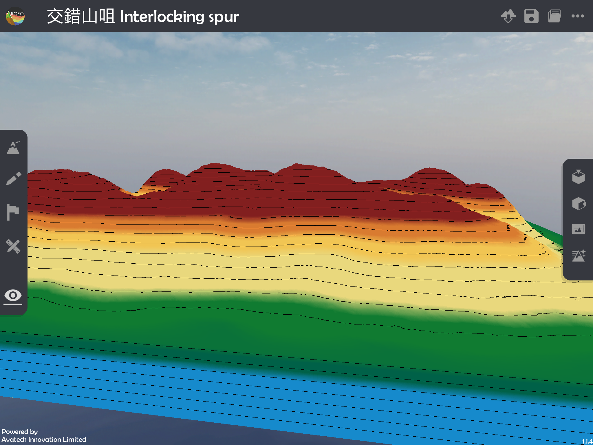

俯视角度(Top View):
-----------------------
按右边工具栏的 |topview| 以调校镜头至俯视角度，由正上方清楚俯视整个地形

.. image:: control_images/overlook.png
  :width: 400
  :alt: Alternative text

预设角度(Default View):
-----------------------
按右边工具栏的 |sideview| 以返回与进入地形时一样的预设观察角度，从则面观察地形

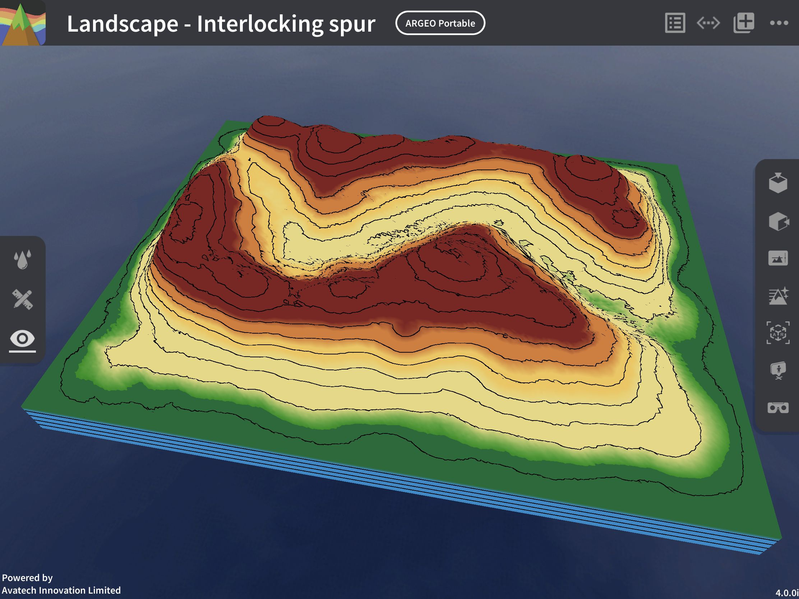

地形塑造(Terrain Modifying)
-----------------------
按左边工具栏的 |terrain_edit_mode| 启动地形塑造，工具操控台将于下方弹出，用家可以单指升高或降低手指接触位置的地形，塑造不同形状的地貌

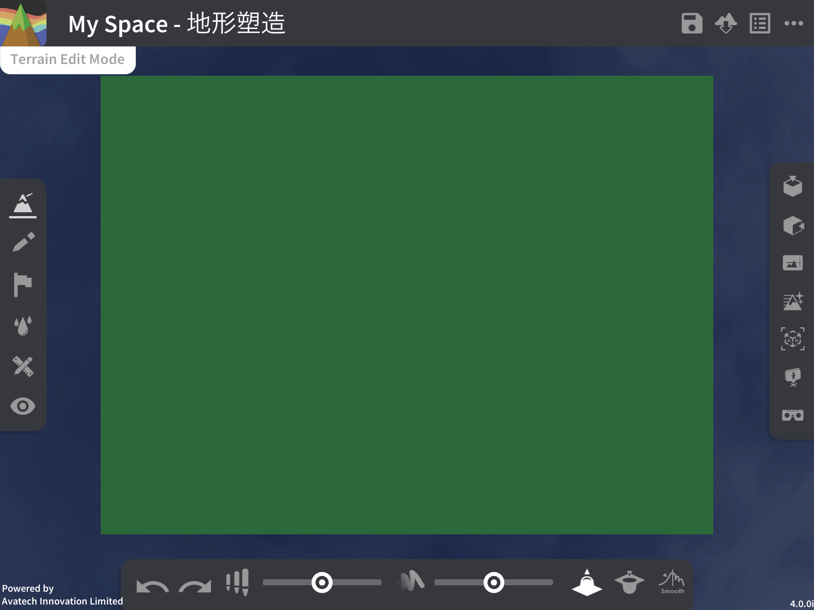

地形塑造的工具操控台:

塑造范围大小 |brush_size| : 调整塑造范围的大小，滑杆标越靠右塑造范围越大

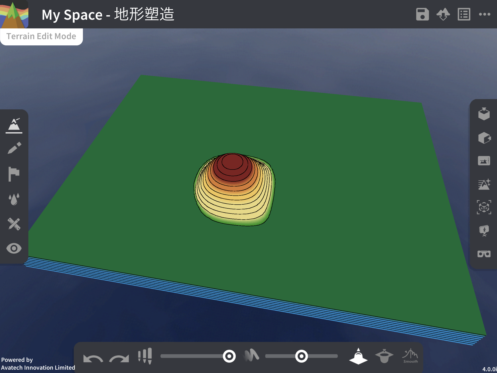

.. image:: control_images/modifying_size2.png
  :width: 400
  :alt: Alternative text

塑造强度 |brush_strength| : 调整塑造强度，塑造强度即地形升高或降低之速度，滑杆标越靠右塑造强度越大

.. image:: control_images/modifying_strength1.png
  :width: 400
  :alt: Alternative text

.. image:: control_images/modifying_strength2.png
  :width: 400
  :alt: Alternative text

 
升高/降低 |extrude_up| |reduce| : 选择升高或降低以决定塑造地形时是升高还是降低地势

.. image:: control_images/modifying_height1.png
  :width: 400
  :alt: Alternative text

.. image:: control_images/modifying_height2.png
  :width: 400
  :alt: Alternative text

绘图工具(Drawing Tools)
-----------------------
按左边工具栏的 |pen| 启动绘图工具，工具操控台将于下方弹出，用家可于地形上绘图及写字，以单指划过地形便会留下笔迹，以此辅助用家解说课堂内容

.. image:: control_images/drawing_tools.png
  :width: 400
  :alt: Alternative text

绘图工具的工具操控台:

颜色: 选择画笔的颜色，有红蓝黄绿白五款颜色

橡皮擦 |eraser| : 使用橡皮擦，以单指划过的笔迹将会被清除。若要退出橡皮擦状态，再次点选此以返回画笔状态
上一步 |undo_white| : 撤销上一步动作，包括画图及橡皮擦清除的动作 (注意: 不包括清除全部之动作)
下一步 |redo_white| : 重做下一步动作，包括画图及橡皮擦清除的动作 (注意: 不包括清除全部之动作)
清除全部 |clear| : 清除地形上所有的笔迹及画笔纪录，此动作不能被撤销

标记工具(Labelling Tools)
-----------------------
按左边工具栏的 |label| 启动标记工具，工具操控台将于下方弹出，用家可于地形落下标记以标示及描述地势特点，以单指触碰地形便可加上标记。新增标记时键盘会弹出供用家输入标记内容，正在选取的标记内容会在工具操控台显示，点击其他标记可选取其以作编辑

.. image:: control_images/labelling_tools1.png
  :width: 400
  :alt: Alternative text

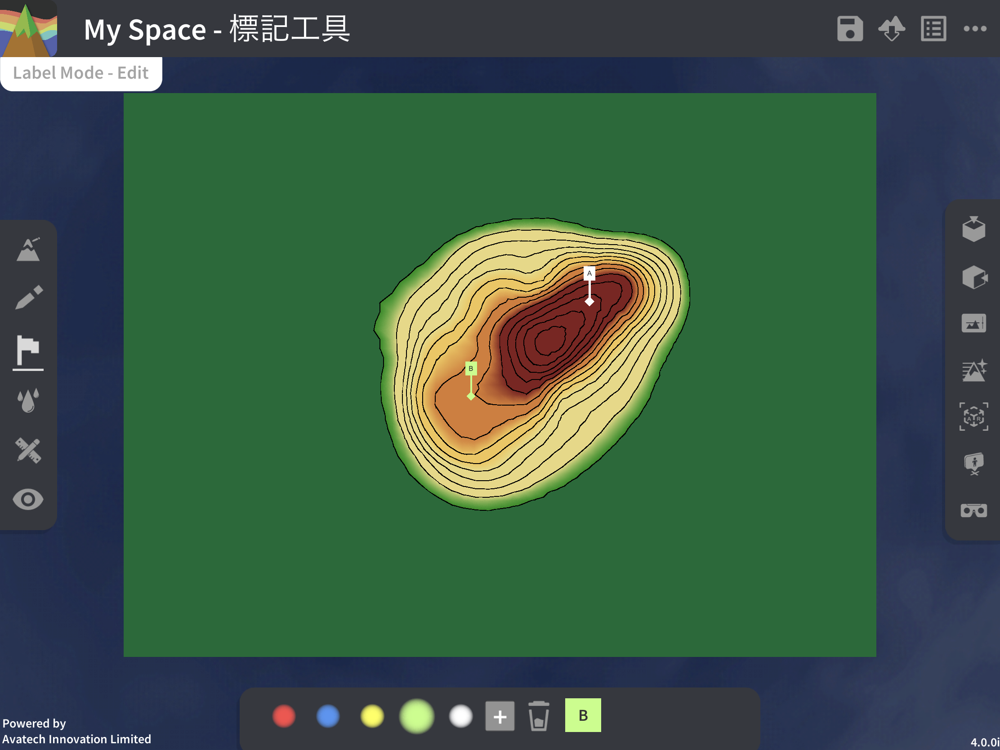

标记工具的工具操控台:

颜色: 选择标记的颜色，有红蓝黄绿白五款颜色
新增标记 : 新增并编辑一个新的标记
清除标记 : 清除正在选取的标记

地图介面(Map View)
-----------------------
按左边工具栏的 |mapview| 启动地图介面，下方的工具操控台将会被收起，开启此后会将地形变为一张加上格网方格地图，右边的工具栏将变做测量工具栏，可于此启用不同的测量工具，使用直尺及量角器进行测量和计算，以教授地图阅读的格网座标及比例计算等

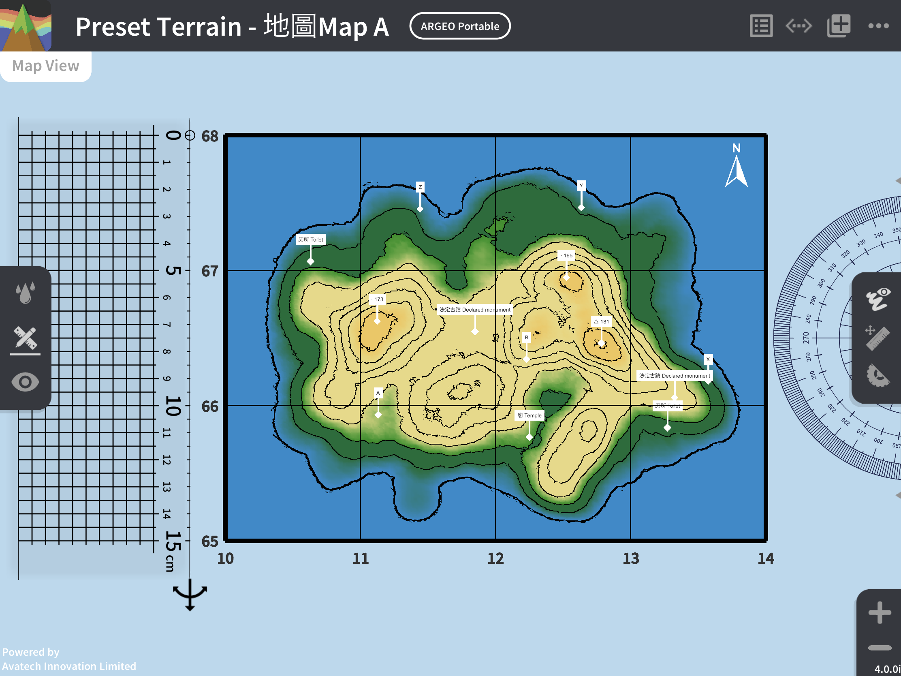

地图介面工具:

格网方格: 地图会加上一个4格乘3格的格网，点击东行线(easting)或北行线(northing)上的任何数字，键盘会弹出供用家更改最左下方的座标相对应之数值
隐藏笔迹 |drawing_hide| : 按一下可隐藏地形上的所有笔迹，再按一下可重新显示笔迹

直尺: 
  - 移动直尺: 点击并拉动直尺便可把其移动至手指触碰的位置
  - 调整长度 |ruler_rotate| : 点击并前后拉动 (missing photo) 便可调整直尺显示的长度
  - 调整方向 |ruler_rotate| : 点击并上下拉动 (missing photo) 便可调整直尺的方向
  - 调整阔度 : 点击并拉动便可调整直尺显示的阔度，增加阔度可将其当为格子尺使用
  - 呼唤直尺 |get_ruler| : 直尺移动至画面左方，其长度及阔度亦会改至较低数值，若直尺移到不可视的位置，可按此立即呼唤直尺到方便取用的位置
  - 横向使用 |horizontal_ruler| : 将直尺的方向调整为横向
  - 纵向使用 |vertical_ruler| : 将直尺的方向调整为纵向

量角器:
  - 移动量角器: 点击并拉动量角器便可把其移动至手指触碰的位置
  - 旋转量角器 |ruler_rotate| : 点击并向顺时针或逆时针方向拉动量角器旁的 (missing photo) 便可向相应方向旋转
  - 呼唤量角器 |angle_ruler|: 量角器移动至画面右方，若直尺移到不可视的位置，可按此立即呼唤量角器到方便取用的位置

放大: 将地图画面放大

缩小: 将地图画面缩小

横切面(Cross-section)
-----------------------
按右边工具栏的 |cross_section| 以显示横切面地形

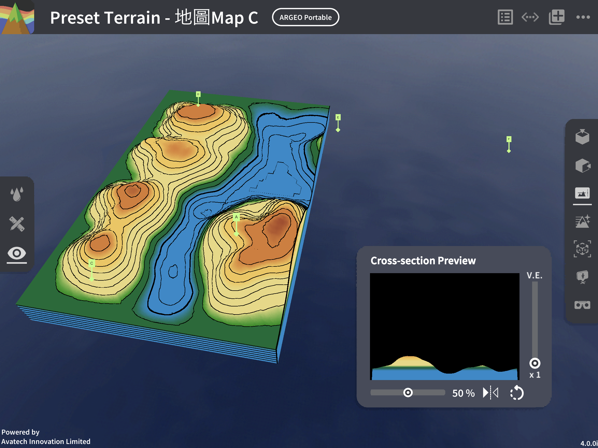

横切面介面:

垂直夸大率(V.E.): 调整横切面图的垂直夸大率，滑杆标越上夸大率越大

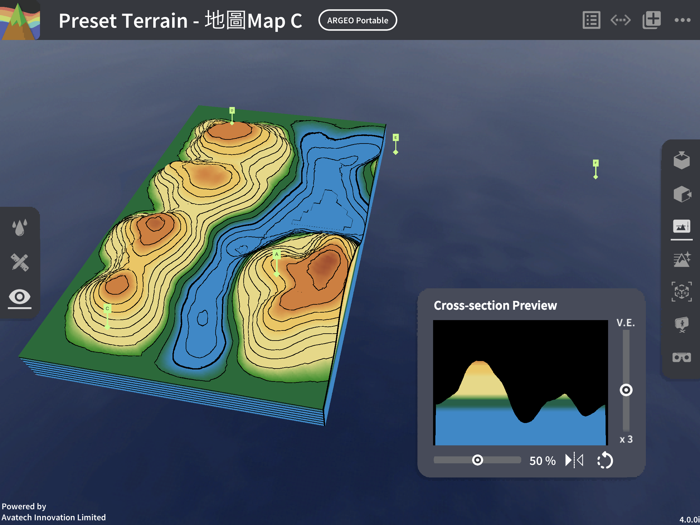

切割方向: 改变横切面的切割方向，可选择横向或纵向

.. image:: control_images/cross_section_direction.png
  :width: 400
  :alt: Alternative text

观察角度 |flip| : 改变观察横切面的视角，可选择由正面或背面观察

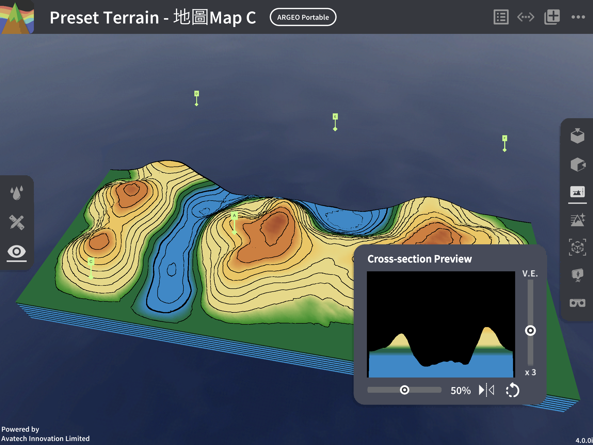

横切面位置: 调整横切面的切割位置

.. image:: control_images/cross_section_position.png
  :width: 400
  :alt: Alternative text

环境调整(Environment Options)
-----------------------
按右边工具栏的 |environmentoptions| 以更改地形的环境特点

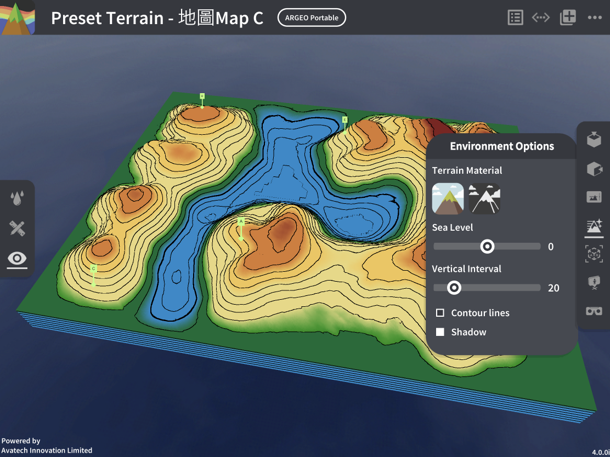

可调整的环境选项:
地貌颜色: 选择自然地貌或黑白色的地形

.. image:: control_images/environment_adjust_color.png
  :width: 400
  :alt: Alternative text

水平线: 调校海平面高度，最小值为-5，最大值为5，用作模拟大陆或离岛的地势，调整海及陆地面积，滑杆标越靠右海平面越高

.. image:: control_images/horizontal_line1.png
  :width: 400
  :alt: Alternative text

.. image:: control_images/horizontal_line2.png
  :width: 400
  :alt: Alternative text

垂直间距: 调校垂直间距，最小值为10，最大值为80，滑杆标越靠右垂直间距越大

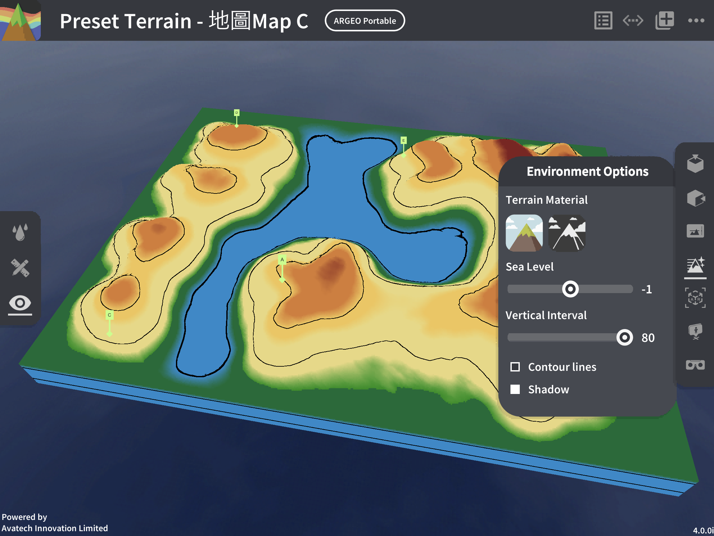

.. image:: control_images/Vertical_Interval2.png
  :width: 400
  :alt: Alternative text

地形质感: 选择地理模式检视方便理解课堂内容或以真实模式检视地形以营造真实感

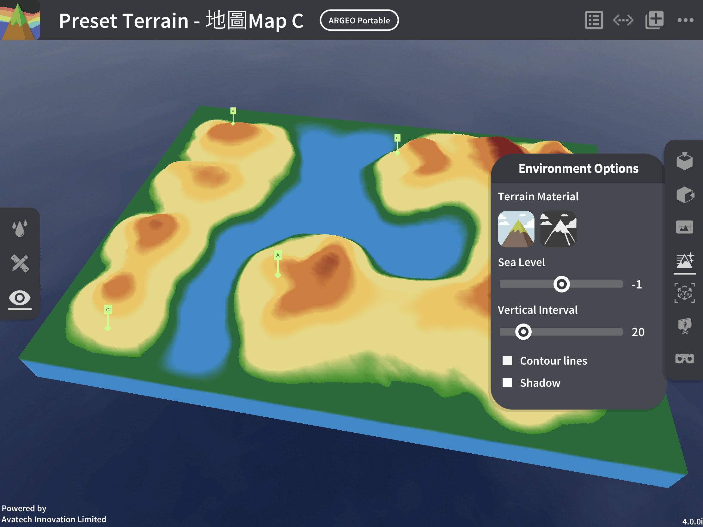

.. image:: control_images/texture2.png
  :width: 400
  :alt: Alternative text 

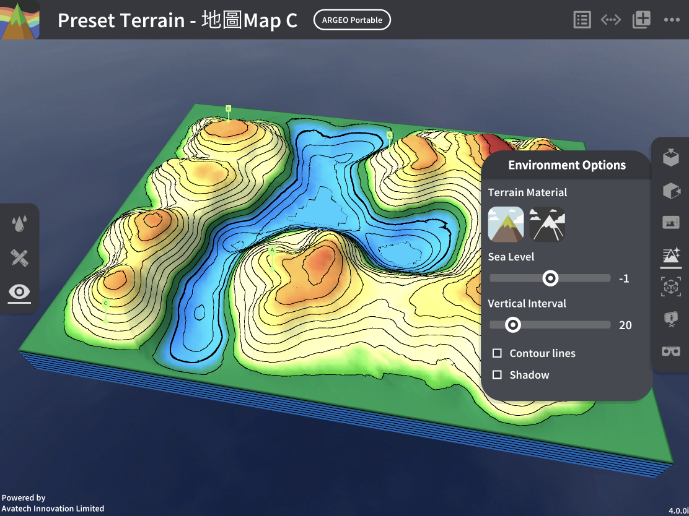

教学示范
-----------------------
课题一: 高度与等高线 Height & Contour line

以下示范为如何以ARGEO Portable教授高度与等高线单元

a. 在「预设地形 (Preset Terrain) |presetterrain| 」中，选择「高度与等高线」。
b. 在「环境调整 (Environment Options) |environmentoptions| 」中调节「垂直间距（Vertical Interval）」至40。

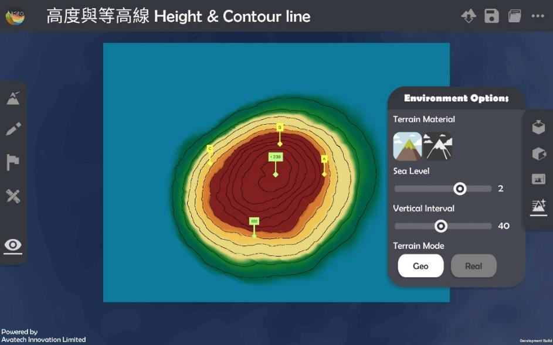

c. 利用已预设的高程点及其他等高线指示，找出A点、B点和C点的高度。

.. image:: control_images/heightcontourline2.jpg
  :width: 400
  :alt: Alternative text

d. 老师可以再塑造更多地形教导学生。

课题二: 地形 Relief
以下示范如何以 ARGEO Portable 教导地形单元。

a. 选择一个「预设地形 (Preset Terrain) |presetterrain| 」，并选择想教授的地形。

.. image:: control_images/relief1.png
  :width: 400
  :alt: Alternative text

b. 使用「俯视角度 |topview|」功能观察地形的等高线。

.. image:: control_images/relief2.jpg
  :width: 400
  :alt: Alternative text

c. 选择「观察模式 |viewmode|」调校视角以观察地形。

.. image:: control_images/relief3.jpg
  :width: 400
  :alt: Alternative text

d. 选择「横切面 |cross_section|」功能，并以滑标调校横切面至合适的位置。

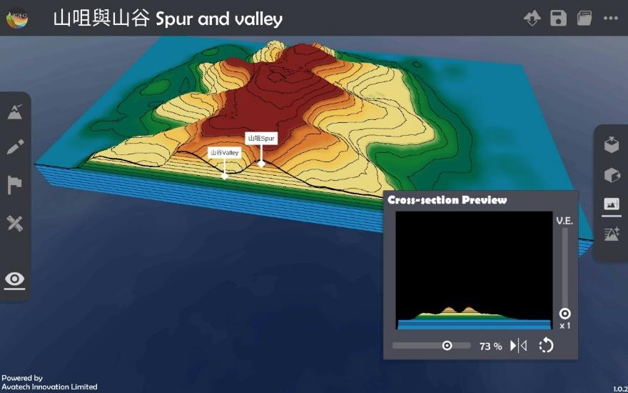

e. 可调校垂直夸大率观察横切面图。

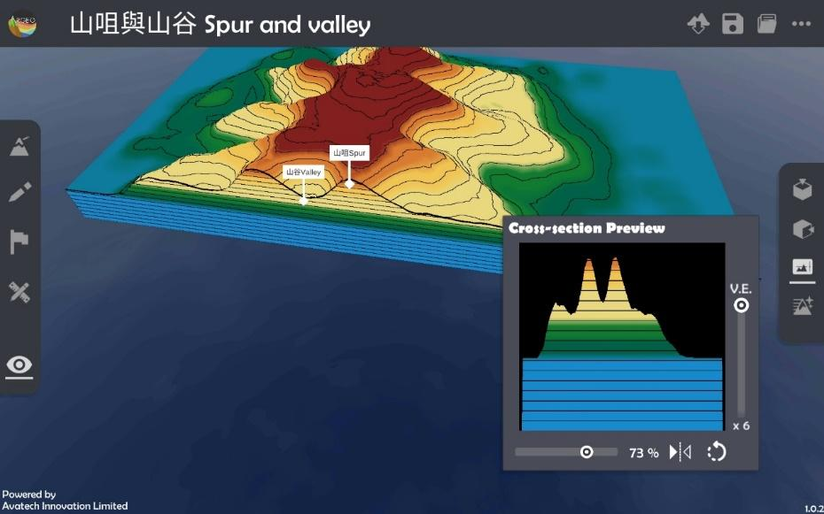

遥距教学使用
-----------------------
Zoom
- 开始分享画面:
1. 在下方(Android)或右上角(iOS)点选分享，选择荧幕(Android)/萤幕(iOS) (注意: 用家需要是主持人或被主持人允许才可分享画面)

.. image:: control_images/zoom1.png
  :width: 400
  :alt: Alternative text

2. 按立即开始(Android)或开始直播(iOS)确认分享

.. image:: control_images/zoom2.png
  :width: 400
  :alt: Alternative text

3. 成功分享用家装置的画面 (注意: 开始分享后所有参与者都能看见画面的所有资讯，包括通知及其他程式的画面 若有不希望公开的资讯请预先更改设定或避免在分享画面期间打开检视内容) (Android用家注意: 开始分享后会跳到装置主画面)

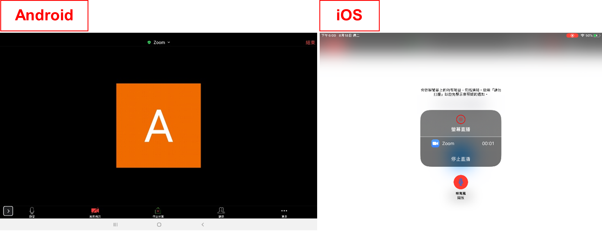

4. 按主目录键离开Zoom但不要关闭应用程式，开启ARGEO Portable 的程式便可开始教学

- 停止分享画面:
  教学结束后退出ARGEO Portable
  Android: 返回Zoom点选下方的停止直播/左下方的工具栏停止分享
  iOS: 返回Zoom点选画面中心的停止直播/在控制中心结束直播

.. image:: control_images/zoom4.png
  :width: 400
  :alt: Alternative text

Google Meet
- 开始分享画面:
1. 按右上角选项，点选显示画面(Android)或分享萤幕画面(iOS)

.. image:: control_images/googlemeet1.png
  :width: 400
  :alt: Alternative text

2. 按开始显示再按立即开始(Android)/开始直播(iOS)确认分享

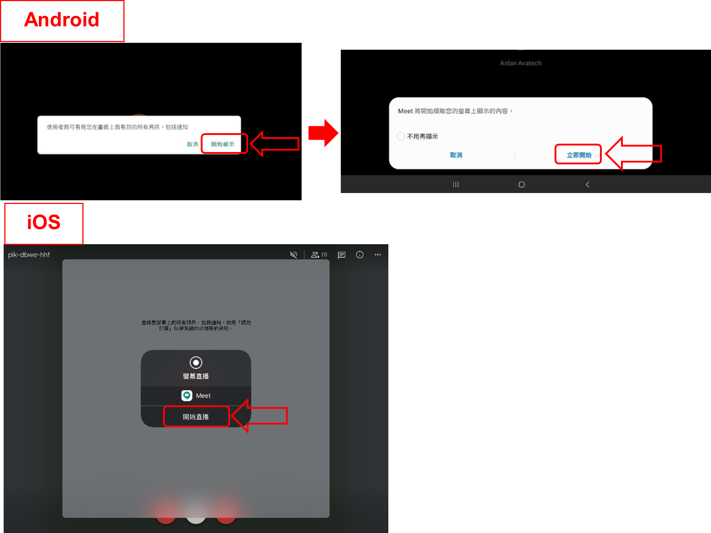

3. 成功分享用家装置的画面 (注意: 开始分享后所有参与者都能看见画面的所有资讯，包括通知及其他程式的画面 若有不希望公开的资讯请预先更改设定或避免在分享画面期间打开检视内容)

.. image:: control_images/googlemeet3.png
  :width: 400
  :alt: Alternative text

4. 按主目录键离开Meet但不要关闭程式，开启ARGEO Portable 的程式便可开始教学

- 停止分享画面:
  教学结束后退出ARGEO Portable
  Android: 返回Meet点选画面中心的停止显示
  iOS: 返回Meet点选画面中心的停止直播/在控制中心结束直播

.. image:: control_images/googlemeet4.png
  :width: 400
  :alt: Alternative text

Microsoft Teams

- 开始分享画面:
1. 按下方的选项，点选分享

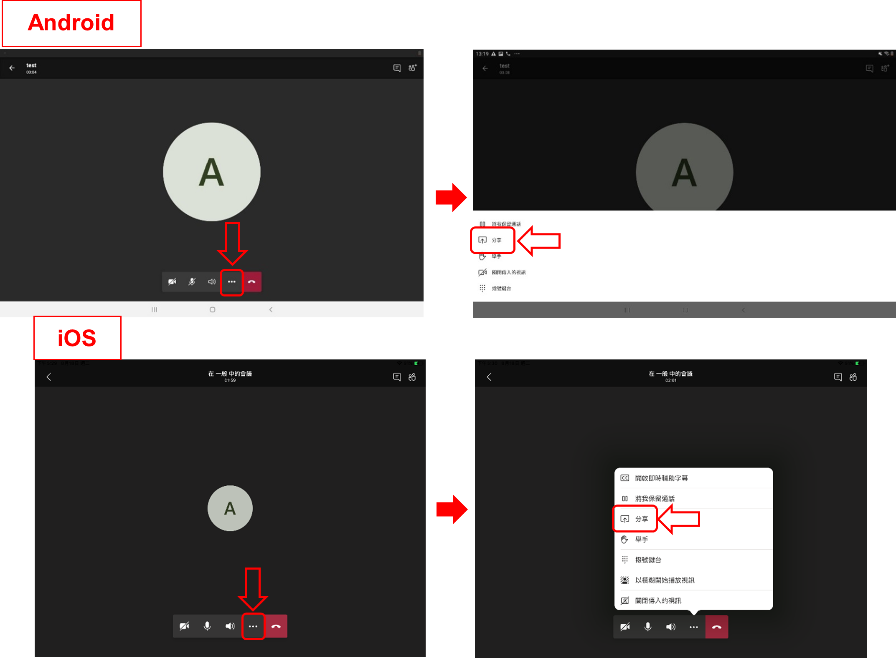

2. 选择分享萤幕画面

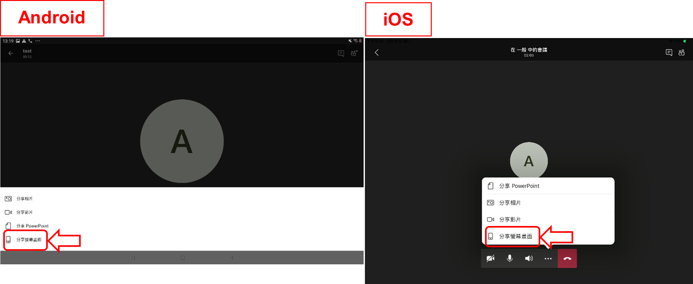

3. 按立即开始(Android)或开始直播(iOS)确认分享

.. image:: control_images/microsoftteams3.png
  :width: 400
  :alt: Alternative text

4. 成功分享用家装置的画面 (注意: 开始分享后所有参与者都能看见画面的所有资讯，包括通知及其他程式的画面 若有不希望公开的资讯请预先更改设定或避免在分享画面期间打开检视内容)

.. image:: control_images/microsoftteams4.png
  :width: 400
  :alt: Alternative text

5. 按主目录键离开Teams但不要关闭程式，开启ARGEO Portable 的程式便可开始教学

- 停止分享画面:
  教学结束后退出ARGEO Portable
  Android: 返回Teams点选下方的停止简报
  iOS: 返回Teams点选画面中心的停止直播/在控制中心结束直播

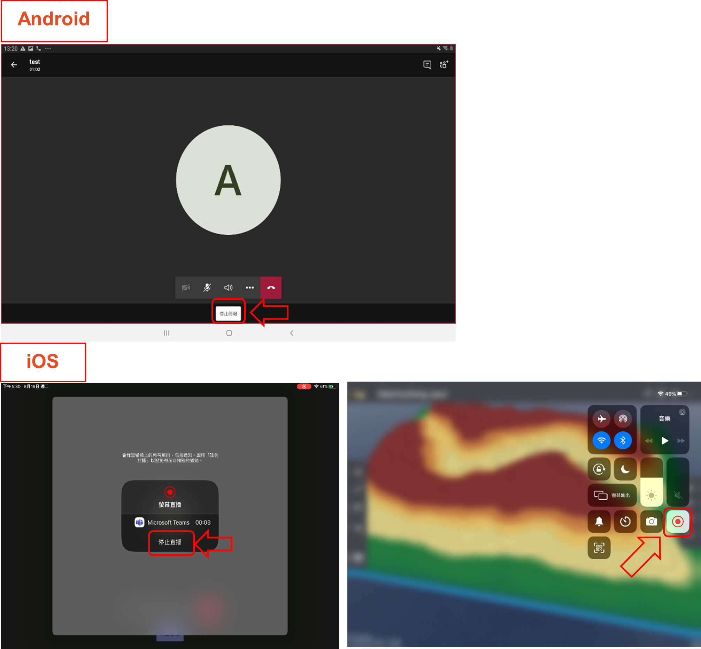

