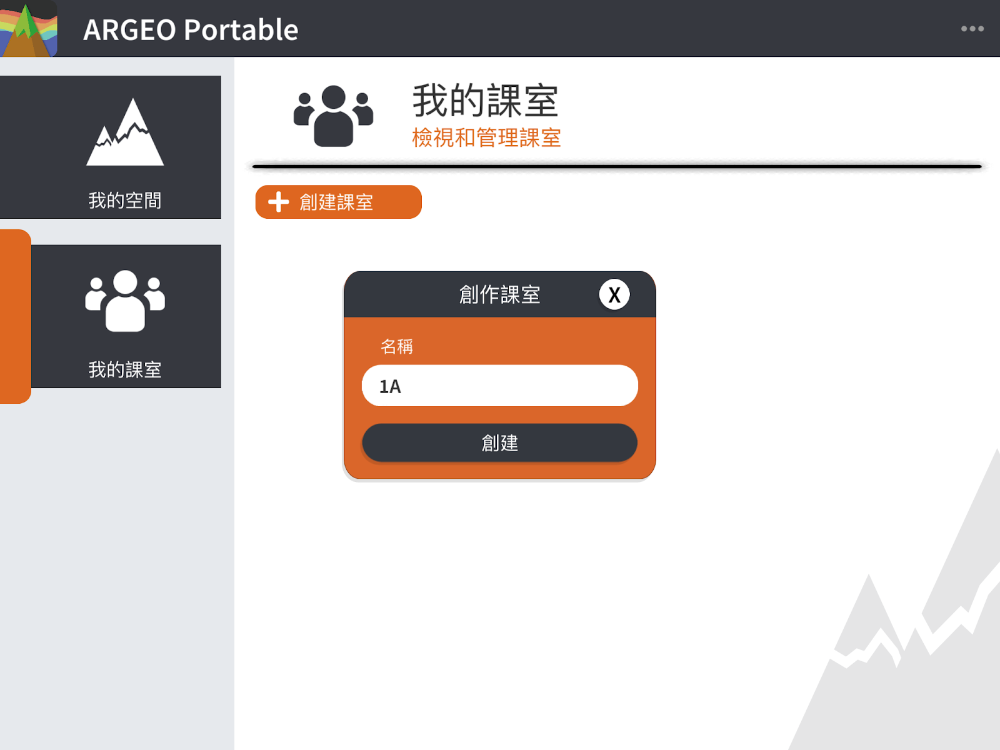
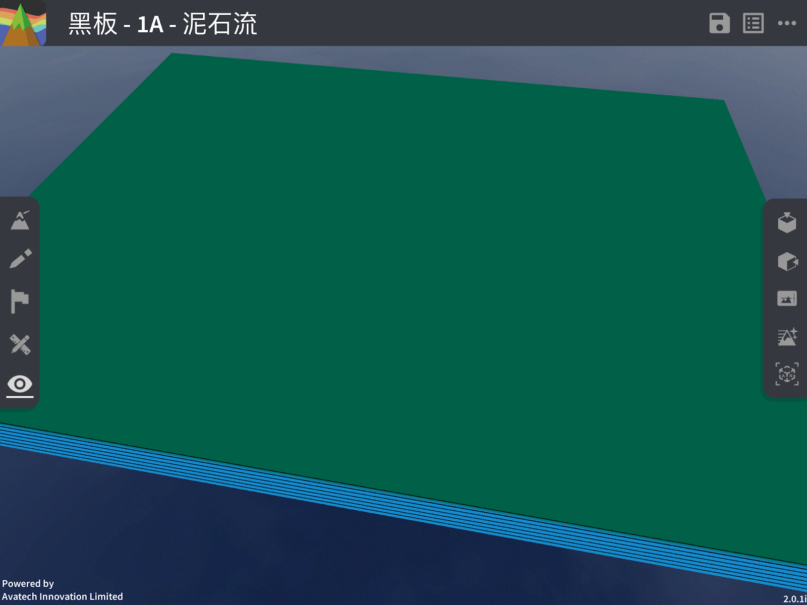
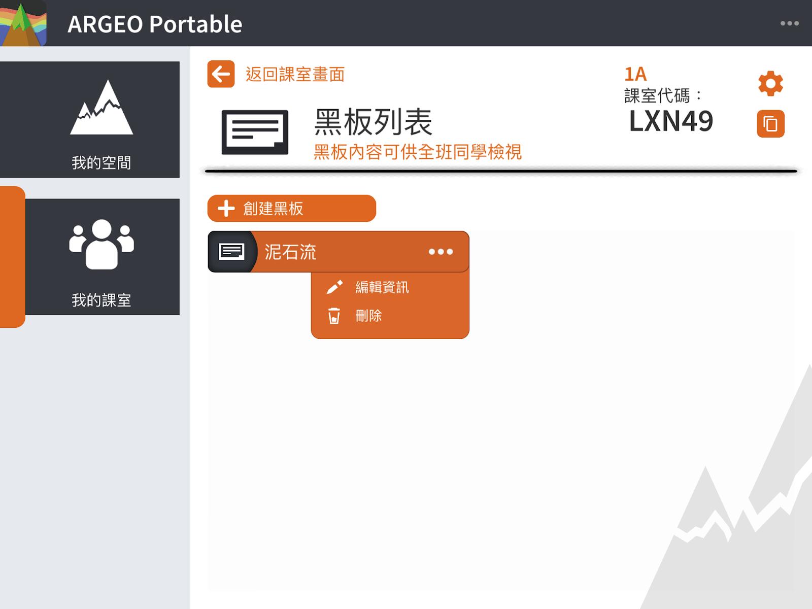
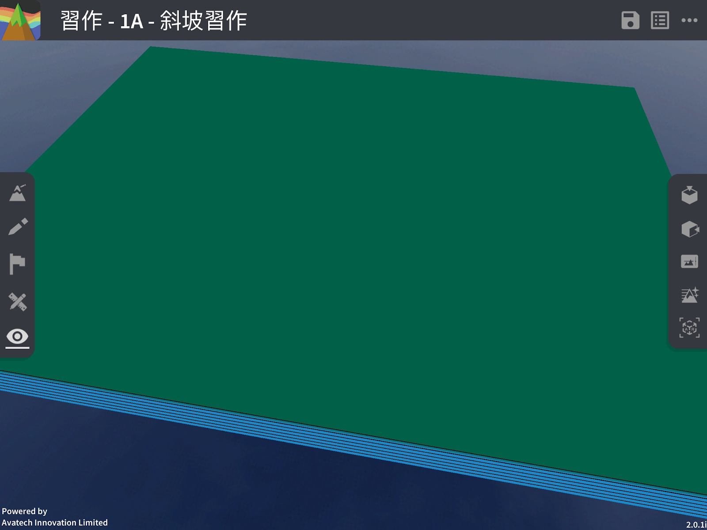

我的班级
===================================

我的班级功能简介
-----------------------
「我的班级」让教师帐户建立班级，并在班级中建立黑板（笔记）及习作，然后分配给学生帐户查看黑板及进行习作。同时，教师可查看该班级内的学生的习作及「我的空间」。教师可建立多个班级，分配不同学生进入不同班级，学生帐户亦可同时加入多个班级。每一名教师帐户都可查看所有属于该许可证下班级内的黑板及习作，而学生帐户则只能查看已加入的班级内的黑板及习作。

教师帐户
-----------------------
创建班级

点击［＋创建班级］按钮

输入班级名称：由中文、英文或数字组成

创建成功后到达班级主画面	

.. image:: myclass_images/teacheracc3.png
  :width: 400
  :alt: Alternative text

邀请学生进入班级
-----------------------
在建立班级后，介面会显示班级邀请码，把此班级邀请码传送给学生输入，学生便能加入班级。
更多资讯：我的班级－学生帐户－加入班级

.. image:: myclass_images/invitestudent.png
  :width: 400
  :alt: Alternative text

班级管理
-----------------------
点击班级名称旁的「设定」按钮，便可打开班级管理介面。
在班级管理内：您可
   → 更改班级名称
   → 重新产生班级邀请码
   → 查看班级内的学生名单
   → 把学生从班级中移除（学生被移除出班级后所有该学生的习作空间将会一并被移除）
   → 移除班级（所有在该班级内的黑板、习作（包括教师及学生）的空间将会一并被移除）

.. image:: myclass_images/classroom.png
  :width: 400
  :alt: Alternative text

班级功能
-----------------------
黑板

黑板功能简介
「黑板」是让教师建立空间让班级内的学生查看，学生只能查看而不能编辑黑板空间。

创建黑板
点击［＋创建黑板］

.. image:: myclass_images/blackboard1.png
  :width: 400
  :alt: Alternative text

输入黑板标题（必填）及内容

.. image:: myclass_images/blackboard2.png
  :width: 400
  :alt: Alternative text

点击［创建］后便会自动进入空间，由此您可以进行编辑

编辑黑板
编辑黑板功能与编辑我的空间相同，详情请参阅 我的空间－编辑我的空间

移除黑板
点击［．．．］打开选单，按下［删除］按钮
   → 当黑板被移除后，班级内的教师及学生将无法再查看或编辑该黑板

习作
-----------------------
习作功能简介
「习作」是让教师建立空间给学生做习作。教师可先建立一个习作空间，然后在空间资讯中写上标题及作答要求，并预先为习作编辑起始空间，当教师选择发布习作后，班级内的学生便能在查看到新习作，而习作内的起始空间则是教师预先为习作编辑的起始空间。

请注意，当教师发布习作后教师只能编辑习作空间资讯，不能习作空间内的内容（例如地形、图标等）。

学生可为习作空间进行编辑，每名学生的习作都会储存在自己的帐户内，教师在学生完成习作后可查看班级内所有学生的习作，但不能进行编辑。

教师发布习作后可把习作的状态改为「不发布」，学生便不能再查看或编辑该习作，但教师仍可查看学生在该习作的空间。

创建习作
点击［＋创建习作］

.. image:: myclass_images/createhw1.png
  :width: 400
  :alt: Alternative text

输入习作标题（必填）及内容

.. image:: myclass_images/createhw2.png
  :width: 400
  :alt: Alternative text

点击［创建］后便会自动进入空间，由此您可以进行编辑习作起始空间

派发习作
点击［派发］把习作派发

.. image:: myclass_images/assignhw1.png
  :width: 400
  :alt: Alternative text

已派发的习作可从［已派发］选项中查看

.. image:: myclass_images/assignhw2.png
  :width: 400
  :alt: Alternative text

学生帐户
-----------------------
加入新班级

点击［＋加入班级］，输入班级邀请码。

.. image:: myclass_images/studentacc1.png
  :width: 400
  :alt: Alternative text

加入成功后到达班级主画面

查看黑板及习作

.. image:: myclass_images/studentacc3.png
  :width: 400
  :alt: Alternative text

.. image:: myclass_images/studentacc4.png
  :width: 400
  :alt: Alternative text

