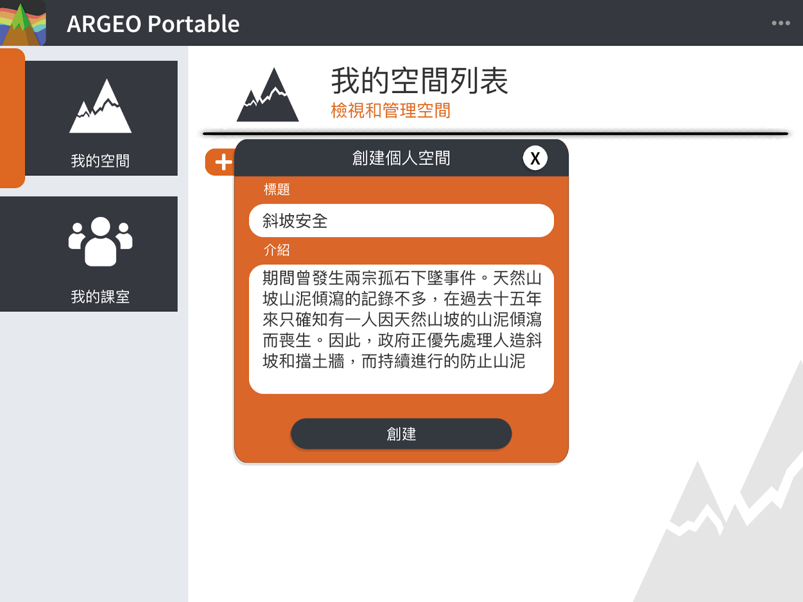
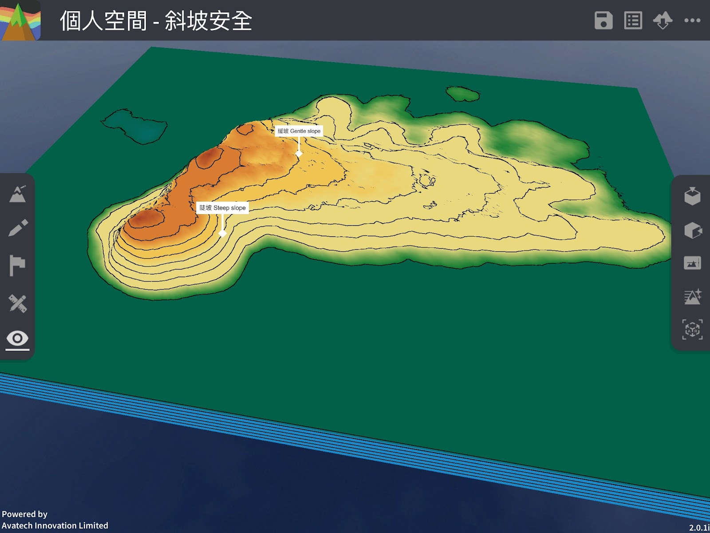
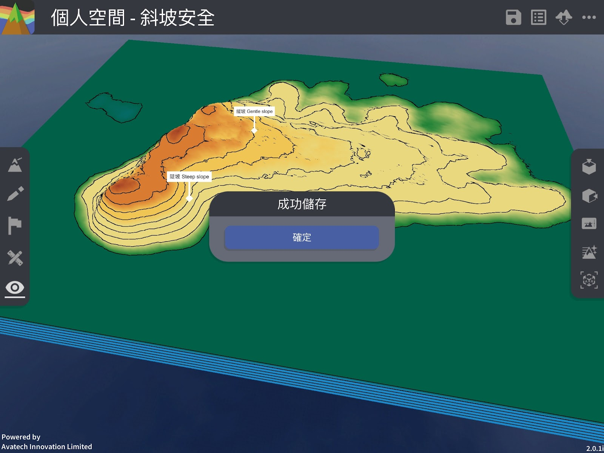
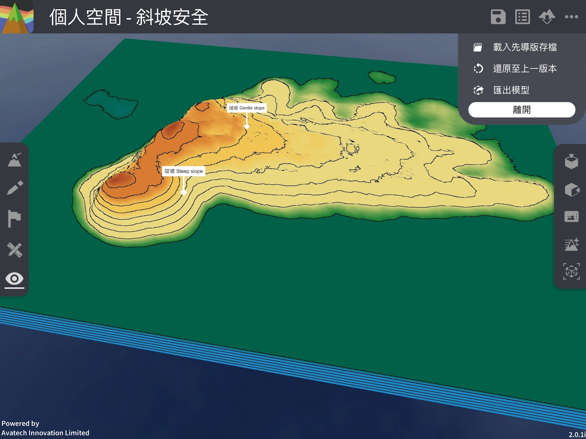

我的空间
===================================

我的空间功能简介

「我的空间」让用户建立个人的地形空间，在空间里您可使用所有编辑功能，包括地形塑造、绘图工具、标记工具及地图介面等，而空间会储存于您的帐户内。教师帐户可查看属于该许可证班级内的学生的「我的空间」，但不能编辑学生的空间。教师或学生帐户是不能查看另一教师的「我的空间」，即使帐户属于同一许可证下。学生帐户必须加入过班级才能使用「我的空间」。

创建我的空间
-----------------------
点击「＋创建空间」按钮

.. image:: myspace_images/myspace.png
  :width: 400
  :alt: Alternative text

输入标题（必填）及内容

点击［创建］后便会自动进入空间，由此您可以进行编辑

.. image:: myspace_images/myspace2.png
  :width: 400
  :alt: Alternative text

编辑我的空间（储存、查看或编辑空间资讯）
-----------------------
经过地形编辑后，您可点击「储存」按钮储存空间。同时您亦可点击「资讯」按钮进行查看或编辑空间资讯。

储存空间

查看或编辑空间资讯

.. image:: myspace_images/myspace5.jpg
  :width: 400
  :alt: Alternative text

退出我的空间
-----------------------
点击右上方［．．．］按钮打开选单，在选单中按［离开］。

移除我的空间
-----------------------
点击［．．．］打开选单，按下［删除］按钮

.. image:: myspace_images/myspace7.png
  :width: 400
  :alt: Alternative text

