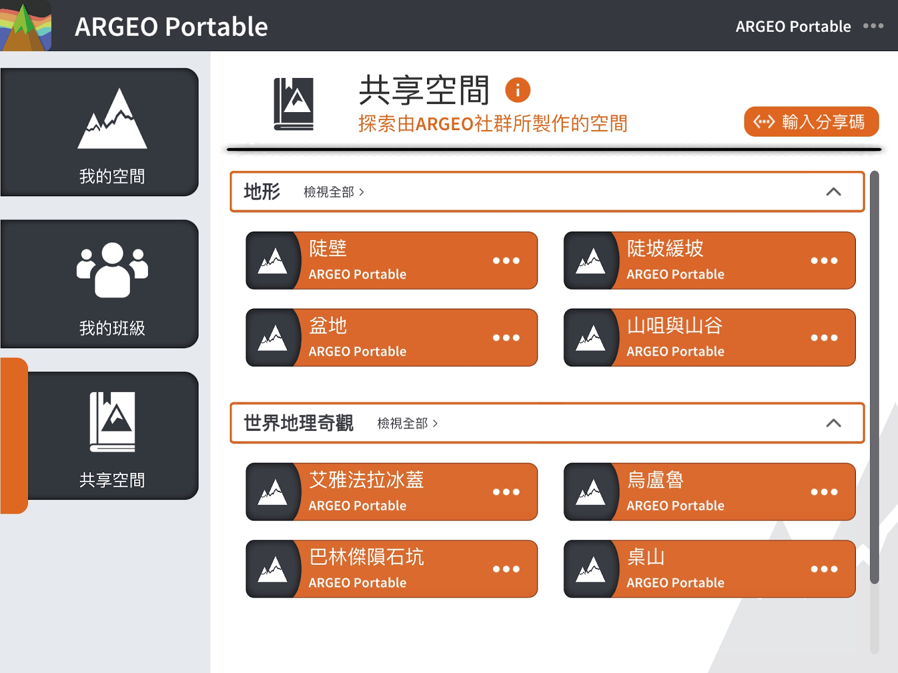

共享空间
===================================

共享空间功能简介
-----------------------
共享空间功能让用户能把自己的空间分享给其他用户，其他用户因而能查看该空间及可取得一个空间副本以作修改，达到共享空间概念。

分享一个空间
-----------------------
在［我的空间］里，选择一个要分享的空间，点击该空间的［．．．］打开选单，按下［分享］

.. image:: sharespace_images/sharespace1.png
  :width: 400
  :alt: Alternative text

.. image:: sharespace_images/sharespace2.png
  :width: 400
  :alt: Alternative text

输入空间资讯：标题、说明。由于使用不同语言的用户都可能会查看到你分享的空间，你可以分别以不同语言填写空间资讯，让使用不同语言的用户都能了解你分享的空间。

.. image:: sharespace_images/sharespace3.png
  :width: 400
  :alt: Alternative text

类别：请选择一个合适的类别

分享设定：你可选择以［公开］或［不公开］形式分享空间
＊公开：可经共享空间或分享码进入空间
＊不公开：仅可以分享码进入空间

注意：当你把空间分享后，你将无法再修改已分享的空间的地形，你只可修改空间资讯，而已分享的空间是不会影响［我的空间］内的空间，即是你仍可编辑［我的空间］内的空间，但若你希望更新已分享的空间的地形，你必须在［我的空间］编辑地形，然后重新分享。

分享码
-----------------------
分享完成后，系统会显示一个分享码，你可把分享码传送给其他用户，他们便可直接查看此分享的空间

点击［输入分享码］

.. image:: sharespace_images/sharespace5.png
  :width: 400
  :alt: Alternative text

输入分享码

.. image:: sharespace_images/sharespace6.png
  :width: 400
  :alt: Alternative text

管理我的空间
-----------------------
在你把空间分享后，你可管理你已分享的空间，包括查看分享码、编辑资讯、删除空间等。
在［我的空间］中，点击［已分享的空间］

.. image:: sharespace_images/sharespace7.png
  :width: 400
  :alt: Alternative text

.. image:: sharespace_images/sharespace8.png
  :width: 400
  :alt: Alternative text

＊若你删除已分享的空间，其他用户便无法再在共享空间或使用分享码查看到你的空间，而删除已分享的空间不会影响［我的空间］内的空间